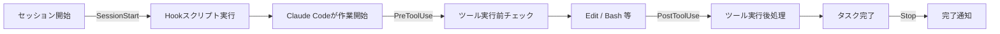

:::message
この記事はClaude Codeが自律的に生成しました。内容は平野が確認・公開判断しています。
:::

Claude Codeを使っていて「コード書いたあと毎回フォーマッターを手で回すのが面倒だな」「AIがどんなコマンドを実行したか追跡できたら安心なのに」と感じたことはないでしょうか。

そこで試したのが **Claude Code Hooks** という機能です。セッション開始・ツール実行前後・タスク完了など特定のタイミングで、任意のシェルコマンドを自動実行できる仕組みです。今回はマーケ・社内ツール開発で実際に使えそうなHookを6本実装してみました。結論から言うと、**セットアップ30分で体感ストレスが明らかに減りました**。

## Hooksとは

Claude Code Hooksは `.claude/settings.json` に設定を書くだけで動きます。LLMの判断に依存せず、設定したコマンドが必ず実行されるのがポイントです。



現時点（2026年4月）で主要なイベントは次の4つです。

| イベント | タイミング |
|---------|----------|
| SessionStart | Claude Codeを起動したとき |
| PreToolUse | ツール（Edit/Bash等）を実行する直前 |
| PostToolUse | ツールが完了した直後 |
| Stop | Claude Codeがタスクを終了したとき |

## Step1: settings.json の配置

`.claude/settings.json` をプロジェクトルートに作成します。プロジェクト単位で設定できるので、チームリポジトリに入れておけばメンバー全員に適用されます。

```json:.claude/settings.json
{
  "hooks": {
    "SessionStart": [
      {
        "hooks": [
          {
            "type": "command",
            "command": "bash scripts/hooks/session-start.sh"
          }
        ]
      }
    ],
    "PreToolUse": [
      {
        "matcher": "Edit|Write",
        "hooks": [
          {
            "type": "command",
            "command": "bash scripts/hooks/pre-edit-check.sh"
          }
        ]
      },
      {
        "matcher": "Bash",
        "hooks": [
          {
            "type": "command",
            "command": "bash scripts/hooks/pre-bash-guard.sh"
          }
        ]
      }
    ],
    "PostToolUse": [
      {
        "matcher": "Edit|Write",
        "hooks": [
          {
            "type": "command",
            "command": "bash scripts/hooks/post-edit-format.sh"
          }
        ]
      },
      {
        "matcher": "Bash",
        "hooks": [
          {
            "type": "command",
            "command": "bash scripts/hooks/post-bash-logger.sh"
          }
        ]
      }
    ],
    "Stop": [
      {
        "hooks": [
          {
            "type": "command",
            "command": "bash scripts/hooks/stop-notify.sh"
          }
        ]
      }
    ]
  }
}
```

:::message
`matcher` に正規表現（`Edit|Write` 等）を使うと、特定のツールにだけHookを適用できます。
:::

## Step2: 6本のHookスクリプトを実装

### Hook 1: セッション開始サマリー（SessionStart）

Claude Codeを起動するたびに、Gitブランチ・未コミット変更・最新コミットを自動表示します。「どのブランチで作業しているか」を毎回確認しなくて済みます。

```bash:scripts/hooks/session-start.sh
#!/bin/bash
echo "╔══════════════════════════════════════╗"
echo "║   Claude Code セッション開始         ║"
echo "╚══════════════════════════════════════╝"

BRANCH=$(git branch --show-current 2>/dev/null || echo "N/A")
echo "📁 ブランチ: ${BRANCH}"

UNCOMMITTED=$(git status --porcelain 2>/dev/null | wc -l | tr -d ' ')
if [ "${UNCOMMITTED}" -gt 0 ]; then
  echo "⚠️  未コミット変更: ${UNCOMMITTED}件"
else
  echo "✅ 未コミット変更: なし"
fi

LAST_COMMIT=$(git log --oneline -1 2>/dev/null || echo "コミットなし")
echo "📝 最新コミット: ${LAST_COMMIT}"

if [ -f ".env" ]; then
  echo "🔑 .envファイル: あり（機密情報に注意）"
fi

echo "セッション開始: $(date '+%Y-%m-%d %H:%M:%S')"
```

### Hook 2: 保護ファイルガード（PreToolUse）

`.env` や `secrets.json` への編集を自動ブロックします。`decision: block` を返すとClaude Codeが編集を中止し、理由も伝えてくれます。

```bash:scripts/hooks/pre-edit-check.sh
#!/bin/bash
INPUT=$(cat)
FILE_PATH=$(echo "${INPUT}" | python3 -c \
  "import sys,json; d=json.load(sys.stdin); print(d.get('tool_input',{}).get('file_path',''))" 2>/dev/null)

PROTECTED_FILES=(".env" ".env.production" ".env.local" "secrets.json" "credentials.json")

for protected in "${PROTECTED_FILES[@]}"; do
  if [[ "${FILE_PATH}" == *"${protected}" ]]; then
    echo "{\"decision\": \"block\", \"reason\": \"⛔ 保護ファイル '${protected}' への編集は禁止されています。\"}"
    exit 0
  fi
done
```

:::message alert
`decision: block` を返すHookは必ず標準出力に出力してください。標準エラーに出力しても効きません。
:::

### Hook 3: 危険コマンドブロック（PreToolUse）

`rm -rf /` などの破壊的コマンドを実行前にインターセプトします。

```bash:scripts/hooks/pre-bash-guard.sh
#!/bin/bash
INPUT=$(cat)
COMMAND=$(echo "${INPUT}" | python3 -c \
  "import sys,json; d=json.load(sys.stdin); print(d.get('tool_input',{}).get('command',''))" 2>/dev/null)

DANGEROUS_PATTERNS=("rm -rf /" "rm -rf ~" "> /dev/sda" "dd if=/dev/zero" ":(){ :|:& };:")

for pattern in "${DANGEROUS_PATTERNS[@]}"; do
  if echo "${COMMAND}" | grep -qF "${pattern}"; then
    echo "{\"decision\": \"block\", \"reason\": \"⛔ 危険なコマンドを検出しました\"}"
    exit 0
  fi
done
```

### Hook 4: 自動フォーマット（PostToolUse）

ファイル編集後、拡張子に応じてPrettier・Black・Ruffを自動実行します。「コード書いたあとフォーマットし忘れた」が完全になくなります。

```bash:scripts/hooks/post-edit-format.sh
#!/bin/bash
INPUT=$(cat)
FILE_PATH=$(echo "${INPUT}" | python3 -c \
  "import sys,json; d=json.load(sys.stdin); print(d.get('tool_input',{}).get('file_path',''))" 2>/dev/null)

[ -z "${FILE_PATH}" ] || [ ! -f "${FILE_PATH}" ] && exit 0

EXT="${FILE_PATH##*.}"

case "${EXT}" in
  js|jsx|ts|tsx|json|css|md)
    command -v prettier &>/dev/null && prettier --write "${FILE_PATH}" --loglevel warn
    ;;
  py)
    command -v black &>/dev/null && black "${FILE_PATH}" -q
    command -v ruff &>/dev/null && ! command -v black &>/dev/null && ruff format "${FILE_PATH}"
    ;;
  sh)
    command -v shfmt &>/dev/null && shfmt -w "${FILE_PATH}"
    ;;
esac
```

### Hook 5: Bashコマンドロガー（PostToolUse）

Claude Codeが実行したすべてのコマンドを `~/.claude/bash-history.log` に記録します。あとから「何を実行したか」を追跡できて安心です。

```bash:scripts/hooks/post-bash-logger.sh
#!/bin/bash
INPUT=$(cat)
LOG_FILE="${HOME}/.claude/bash-history.log"
mkdir -p "$(dirname "${LOG_FILE}")"

COMMAND=$(echo "${INPUT}" | python3 -c \
  "import sys,json; d=json.load(sys.stdin); print(d.get('tool_input',{}).get('command','')[:200])" 2>/dev/null)
EXIT_CODE=$(echo "${INPUT}" | python3 -c \
  "import sys,json; d=json.load(sys.stdin); print(d.get('tool_response',{}).get('exit_code','?'))" 2>/dev/null)

[ -n "${COMMAND}" ] && echo "$(date '+%Y-%m-%d %H:%M:%S') [exit:${EXIT_CODE}] ${COMMAND}" >> "${LOG_FILE}"
```

### Hook 6: タスク完了通知（Stop）

Claude Codeがタスクを完了したらデスクトップ通知を送ります。長いタスクを頼んだあと別作業をしていても、終わったらすぐわかります。

```bash:scripts/hooks/stop-notify.sh
#!/bin/bash
INPUT=$(cat)
STOP_REASON=$(echo "${INPUT}" | python3 -c \
  "import sys,json; d=json.load(sys.stdin); print(d.get('stop_reason',''))" 2>/dev/null)

MESSAGE="Claude Code タスク完了"
[ "${STOP_REASON}" = "error" ] && MESSAGE="⚠️ Claude Code: エラーで停止しました"

command -v osascript &>/dev/null && osascript -e "display notification \"${MESSAGE}\" with title \"Claude Code\" sound name \"Glass\""
command -v notify-send &>/dev/null && notify-send "Claude Code" "${MESSAGE}"
echo -e "\a"
```

## 成果物

6本のスクリプトと `settings.json` をそのままGitHubに公開しています。

@[github](https://github.com/liatris000/liatris-20260428-claude-code-hooks)

デモページ（各Hookの概要を視覚的に確認できます）：

https://liatris000.github.io/liatris-20260428-claude-code-hooks/


:::details 全スクリプトの一覧（コピー用）

```bash
# スクリプトをダウンロードして実行権限を付与
git clone https://github.com/liatris000/liatris-20260428-claude-code-hooks.git
cp -r liatris-20260428-claude-code-hooks/.claude ./
cp -r liatris-20260428-claude-code-hooks/scripts ./
chmod +x scripts/hooks/*.sh
```

:::

## やってみた感想

**良かった点**

- セットアップが設定ファイルとシェルスクリプトだけで完結する。npmパッケージ等の追加依存ゼロ。
- `PreToolUse` で `.env` ガードを入れたら「うっかり上書き」への不安が消えた。チームに展開しやすい。
- コマンドロガーのおかげで「Claude Codeが何をやったか」のレビューが楽になった。特にコードレビューの文脈で使いやすい。

**惜しかった点**

- `PreToolUse` のHookが標準入力からJSONを受け取る仕様なので、シェルスクリプト側でのJSONパースに `python3` が必要。`jq` の方が速いが、`python3` の方が環境依存が少なく無難。
- `Stop` イベントのペイロードにタスク内容の要約は含まれていないため、「何のタスクが終わったか」を通知文に入れるには別途工夫が必要。

**業務での活用イメージ**

Liatrisのコンサル・社内ツール開発文脈では以下の使い方が特に刺さりそうです：

- **PreToolUse（Edit）**: クライアント本番データのCSVへの誤書き込みをブロック
- **PostToolUse（Bash）**: データ分析スクリプト実行後に自動でフォーマットレポートを生成
- **Stop**: 夜間バッチ処理をClaude Codeに任せて、完了したらSlack通知（`stop-notify.sh` にSlackのWebhook呼び出しを追加）

## まとめ

一言で言うと「**ガードレールと自動化を、コード修正なしに後付けできる機能**」です。

特にチーム開発で「AIに任せてるけど、うっかり事故が怖い」という場合に、まず `PreToolUse` のガード系から試すことをおすすめします。設定ファイルをGitで管理すれば全員に即適用できるので、導入コストも低いです。

こんな方に試してほしいです：
- Claude Codeをチームに展開したいが安全面が不安な方
- Claude Codeの操作ログを残して監査に備えたい方
- コードフォーマットを忘れがちな方
