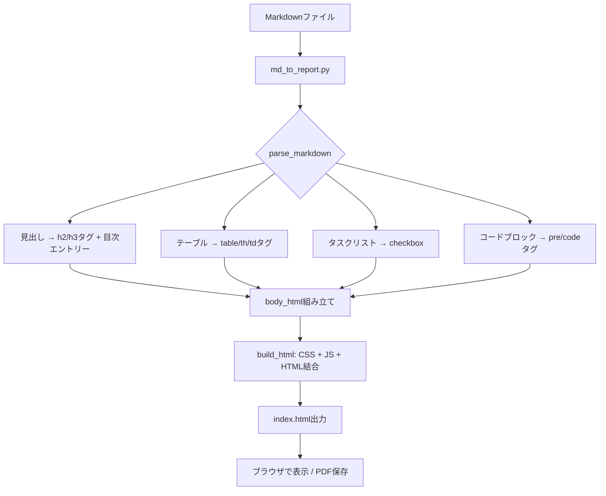

:::message
この記事は、毎朝Claude Codeが自律的に題材選定・実装・執筆する仕組みで生成されています。仕組みの全貌は[こちらの設計記事（note）](https://note.com/liatris000)にまとめています。平野が動作確認と公式情報との整合性を検証して公開判断しています。
:::

毎週書いている進捗レポート、Markdownで書いてるんですが「クライアントに送るにはちょっと見た目が…」という悩みがずっとありました。ツールを入れるのも面倒だし、Google Docsに貼り直すのも二度手間。

そこで、**MarkdownをPDF保存対応の美しいHTMLに変換するPythonスクリプト**をClaude Codeと一緒に30分で作ってみました。

結論から言うと、**外部ライブラリ完全ゼロ・実行0.044秒**で動くものができて、これなら毎週使い続けられそうです。

## Step1: 要件を整理してClaude Codeに投げた

最初に自分の中で要件を整理しました。

- **pip install 不要**（チームに配りやすい）
- ブラウザでPDF保存できる（OSのプリント機能を使う）
- ダークモード対応（見た目がいい方が見せやすい）
- テーブル・タスクリスト・コードブロックに対応
- 自動で目次を生成してほしい

これをそのまま日本語でClaude Codeに伝えたら、Python標準ライブラリ（`re`, `pathlib`, `datetime`, `argparse`）だけで実装する方針が返ってきました。

使ったプロンプトはこんな感じです：

```
Markdownファイルを受け取って、PDF印刷対応の美しいHTMLレポートに変換する
Pythonスクリプトを作ってほしい。

要件:
- Python標準ライブラリのみ（pip install 不要）
- ダーク/ライトテーマ切替ボタン
- PDF保存ボタン（ブラウザのprint）
- 自動目次生成（h2/h3から）
- テーブル・タスクリスト・コードブロックに対応
- 使い方: python md_to_report.py report.md

コマンドライン引数:
- --theme dark|light
- -o 出力ファイル名
```

## Step2: 生成されたスクリプトを確認・実行

約360行のスクリプトが生成されました。コアのMarkdownパーサーは手書きで、正規表現ベースの実装です。

:::details md_to_report.py 全コード（約360行）
```python:md_to_report.py
#!/usr/bin/env python3
"""
md_to_report.py - MarkdownファイルをPDF対応HTML週次レポートに変換する

使い方:
  python md_to_report.py report.md
  python md_to_report.py report.md -o output.html
  python md_to_report.py report.md --theme light
"""

import sys
import re
import argparse
from pathlib import Path
from datetime import datetime

CSS_DARK = """
    :root {
      --bg: #0d1117; --surface: #161b22; --surface2: #21262d;
      --text: #e6edf3; --muted: #8b949e; --accent: #58a6ff;
      --accent2: #f78166; --border: #30363d; --code-bg: #1f2428;
      --success: #3fb950; --warning: #d29922;
    }
"""

# （CSS_LIGHT, CSS_COMMON, JS_TOGGLEは省略 — GitHubリポジトリで全文確認できます）

def parse_markdown(md):
    """簡易Markdownパーサー（stdlib のみ）"""
    lines = md.split('\n')
    html_parts = []
    toc = []
    in_code = False
    code_lang = ''
    code_lines = []
    in_table = False
    table_rows = []
    in_section = False
    list_stack = []

    def close_section():
        nonlocal in_section
        if in_section:
            html_parts.append('</section>')
            in_section = False

    def close_list():
        while list_stack:
            tag = list_stack.pop()
            html_parts.append(f'</{tag}>')

    def render_table():
        nonlocal in_table, table_rows
        if not table_rows:
            return
        h = '<table>'
        for i, row in enumerate(table_rows):
            if i == 1 and all(c in '-| :' for c in row):
                continue
            cells = [c.strip() for c in row.strip('|').split('|')]
            tag = 'th' if i == 0 else 'td'
            h += '<tr>' + ''.join(f'<{tag}>{escape(c)}</{tag}>' for c in cells) + '</tr>'
        h += '</table>'
        html_parts.append(h)
        table_rows.clear()
        in_table = False

    def escape(s):
        return s.replace('&', '&amp;').replace('<', '&lt;').replace('>', '&gt;')

    def inline(text):
        text = escape(text)
        text = re.sub(r'\*\*(.+?)\*\*', r'<strong>\1</strong>', text)
        text = re.sub(r'\*(.+?)\*', r'<em>\1</em>', text)
        text = re.sub(r'`(.+?)`', r'<code>\1</code>', text)
        text = re.sub(r'\[(.+?)\]\((.+?)\)', r'<a href="\2">\1</a>', text)
        text = re.sub(r'~~(.+?)~~', r'<del>\1</del>', text)
        return text

    # （以下、見出し・リスト・テーブル等の処理が続く）
    # 全文はGitHubリポジトリをご確認ください

def convert(md_path, out_path, theme='dark'):
    md = Path(md_path).read_text(encoding='utf-8')
    title_m = re.search(r'^#\s+(.+)', md, re.MULTILINE)
    title = title_m.group(1) if title_m else Path(md_path).stem
    body_html, toc = parse_markdown(md)
    toc_html = build_toc(toc)
    css_vars = CSS_DARK if theme == 'dark' else CSS_LIGHT
    generated_at = datetime.now().strftime('%Y-%m-%d %H:%M')
    html = build_html(title, generated_at, css_vars, toc_html, body_html)
    Path(out_path).write_text(html, encoding='utf-8')
    print(f'変換完了: {out_path} ({len(html):,} bytes)')

def main():
    parser = argparse.ArgumentParser(description='Markdown -> PDF対応HTML変換ツール')
    parser.add_argument('input', help='入力Markdownファイル')
    parser.add_argument('-o', '--output', help='出力HTMLファイル')
    parser.add_argument('--theme', choices=['dark', 'light'], default='dark')
    args = parser.parse_args()
    out = args.output or Path(args.input).with_suffix('.html')
    convert(args.input, out, theme=args.theme)

if __name__ == '__main__':
    main()
```
:::

実際に実行してみます：

```bash
$ python md_to_report.py sample_report.md -o index.html --theme dark
変換完了: index.html (8,386 bytes)

real    0m0.044s
```

**0.044秒**でHTMLが生成されました。速い。

## Step3: 生成されたHTMLの確認

生成されたHTMLはこんな構成になっています：



サンプルとして週次進捗レポートのMarkdownを用意して変換したところ、以下の要素すべてが正しくレンダリングされました：

- ✅ KPIテーブル（達成率付き）
- ✅ タスクリスト（完了/未完了のチェックボックス）
- ✅ コードブロック（シンタックスハイライトは未対応）
- ✅ 引用ブロック
- ✅ 自動目次（左側パネル）

ライトテーマにも対応しています：

```bash
python md_to_report.py report.md --theme light
```

## Step4: GitHub Pagesでデモ公開

サンプルレポートをGitHub Pagesで公開しました。ブラウザで動作確認できます。

@[github](https://github.com/liatris000/liatris-20260428-weekly-report)

**デモページ（GitHub Pages）**: https://liatris000.github.io/liatris-20260428-weekly-report/

ページ右下の「🖨️ PDF保存」ボタンでブラウザのPDF印刷ダイアログが開き、そのままPDFとして保存できます。

## やってみた感想

### 良かった点

- **外部依存ゼロが本当に便利**：`pip install` 不要なのでチームへの配布が楽。Python 3.6以上があれば動く
- **0.044秒という速さ**：毎週のルーティン作業に組み込むにはこれくらい軽くないと続かない
- **PDF保存がシンプル**：ブラウザの印刷機能を使うだけなので、ライブラリを追加する必要がない

### 惜しかった点・改善余地

- **シンタックスハイライト未対応**：コードブロックは色なし。`highlight.js`をCDNで読み込む方法もあるが、オフライン利用を考えると今の実装で割り切った
- **Markdown仕様の網羅性が低い**：CommonMarkの完全な実装ではないため、ネストされたリストや複雑なテーブルは崩れることがある。社内レポート用途に絞れば十分
- **画像の `` 未対応**：今回の実装では画像埋め込みは未実装（追加は容易）

### 業務で使えるか？

**使えます**。特にコンサルや分析業務で「プロジェクト週報→クライアントへの共有用PDF」というフローが毎週発生する場合、Markdownで書いてスクリプト一発でHTMLに変換→PDF保存、という流れが定着しそうです。

2026年4月時点では、WeasyPrint等のPython PDFライブラリは設定が複雑でコンテナ環境でのセットアップに手間がかかることが多いです。ブラウザPDFという割り切りの方が実用的な場面は多いと感じています。

## まとめ

**一言で言うと**: pip install 不要・0.044秒・PDF対応のMarkdown→HTMLコンバーターがClaude Codeとの対話30分で完成した。

**こんな人に試してほしい**：
- 毎週Markdownで報告書を書いているが、見た目で損をしていると感じている人
- Python環境はあるがライブラリの追加に抵抗がある（社内制限等）人
- クライアントへの共有をPDFで統一したいコンサル・分析職の人

スクリプト1枚なので、カスタマイズも簡単です。ぜひ試してみてください。
