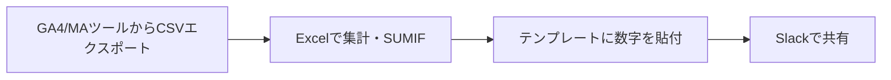

:::message
この記事は、Claude Codeを執筆支援に使った "毎朝1本書く" 取り組みの一環で書いています。

- 目的: 自分のAI活用キャッチアップ。仕組み自体も毎月アップデートしていきます
- 体制: 題材選定・実装・下書きをClaude Codeで補助、平野が動作確認と編集を経て公開判断
- 方針: Zennのガイドラインに真摯に向き合い、運営から指摘や警告があれば即座に取り組みを停止します

仕組みの全貌は[こちらの設計記事(note)](https://note.com/liatris000)にまとめています。
:::

毎週月曜の朝、GA4やMAツールのデータをExcelで集計してSlackに貼る「週次KPIまとめ」の作業があります。数字を拾ってテンプレートに埋めるだけなのに、毎回30分以上かかっていました。「CSVをそのままClaudeに渡してHTMLレポートを生成させたら解決するのでは」と試してみました。

結論から言うと、**CSVデータを渡してプロンプトを整えるだけで、グラフ・インサイト・推奨アクション込みのHTMLレポートが生成されました**。完成まで40分ほどかかりましたが、うち実質のプロンプト調整は2〜3回。体感は「作った」というより「引き出した」に近かったです。

## Step 1: 現状の課題整理

週次レポートのフローは以下の通りです：



Bの「集計」とCの「テンプレート貼付」が面倒な部分です。毎週同じ作業なのに微妙に列構成が変わるため、完全自動化できずにいました。kubellでの社内業務でも似た課題を抱えていたので、Claude APIを使ったスクリプト化を試みました。

## Step 2: CSVデータの設計

実際のGA4エクスポートをイメージして、チャネル×週のマトリクス形式のサンプルCSVを作成しました。

```csv:sample_data.csv
週,チャネル,セッション数,CV数,CVR(%),売上(万円),CPA(円),ROI(%)
2026/4/1,検索広告,12450,187,1.50,374,5349,112
2026/4/1,ディスプレイ,8320,64,0.77,128,7813,68
2026/4/1,SNS,6780,92,1.36,184,4348,143
2026/4/1,メール,3210,88,2.74,176,2273,285
2026/4/1,オーガニック,9870,156,1.58,312,0,∞
2026/4/8,検索広告,13120,201,1.53,402,4975,127
...（4週間分・5チャネル = 20行）
```

必要な指標（セッション・CV・CVR・売上・CPA・ROI）をすべて含めておくと、Claudeがインサイトを出しやすくなります。

## Step 3: レポート生成スクリプトの実装

Anthropic SDKを使ったNode.jsスクリプトをClaude Codeで書きました。

```bash
npm install @anthropic-ai/sdk
```

:::details generate_report.js（全コード）
```js:generate_report.js
const Anthropic = require("@anthropic-ai/sdk");
const fs = require("fs");
const path = require("path");

const client = new Anthropic();

const csvData = fs.readFileSync(
  path.join(__dirname, "sample_data.csv"),
  "utf-8"
);

const prompt = `以下は2026年4月のマーケティングKPIデータ（CSV形式）です。

${csvData}

このデータを分析して、以下の条件を満たす完全なHTMLレポートを生成してください：

**要件**：
1. 単独で動作するHTMLファイル（外部CDN不使用、インラインCSS/JS）
2. ヘッダー: タイトル「2026年4月 マーケティングKPIレポート」、生成日時
3. KPIサマリーカード: 総セッション数・総CV数・平均CVR・総売上の4枚
4. チャネル別パフォーマンステーブル（週次集計）
5. 週次トレンドをチャートで可視化（SVGを使ったシンプルな折れ線グラフ）
6. インサイトセクション: データから読み取れる3つの重要な発見
7. 推奨アクションセクション: 具体的なネクストアクション2〜3件
8. デザイン: ダークネイビー基調のモダンなビジネスダッシュボード風、レスポンシブ対応

**重要**: <!DOCTYPE html>から始まり</html>で終わる完全なHTMLのみを返してください。`;

async function generateReport() {
  console.log("Claude にHTMLレポート生成を依頼中...");
  const startTime = Date.now();

  const message = await client.messages.create({
    model: "claude-opus-4-7",
    max_tokens: 16000,
    messages: [{ role: "user", content: prompt }],
  });

  const elapsed = ((Date.now() - startTime) / 1000).toFixed(1);
  console.log(`生成完了: ${elapsed}秒`);

  const trimmed = message.content[0].text.trim();
  const reportPath = path.join(__dirname, "report.html");

  if (trimmed.startsWith("<!DOCTYPE") || trimmed.startsWith("<html")) {
    fs.writeFileSync(reportPath, trimmed);
  } else {
    const match = trimmed.match(/```html?\n?([\s\S]+?)\n?```/);
    fs.writeFileSync(reportPath, match ? match[1] : trimmed);
  }

  console.log(
    `使用トークン: input=${message.usage.input_tokens}, output=${message.usage.output_tokens}`
  );
}

generateReport().catch(console.error);
```
:::

### モデル選定について

`claude-opus-4-7` を指定しています。2026年4月にリリースされたClaude Opus 4.7は、MaxおよびTeam Premiumプランのデフォルトモデルです。コード生成・HTML構造化・データ分析とインサイト生成を一度のリクエストでこなす必要があるため、Sonnetより高い推論能力が活きます。

### プロンプト設計のコツ

最初のバージョンでは説明文がHTMLの外側に混入してファイルが壊れることがありました。要件の最後に `<!DOCTYPE html>から始まり</html>で終わる完全なHTMLのみを返してください` と明示することで解決しました。

:::message alert
**APIキーの設定**

スクリプトを実行する前に、[Anthropic Console](https://console.anthropic.com/)でAPIキーを発行して環境変数にセットしてください。

```bash
export ANTHROPIC_API_KEY="sk-ant-..."
node generate_report.js
```

Claude Code on the webの環境ではOAuth認証が使われるため、`ANTHROPIC_API_KEY`を別途設定せずにSDKを呼ぶと認証エラーになります。今回はこのケースに実際に遭遇しました。
:::

## Step 4: 生成されたレポートを確認

実際に生成されたHTMLレポートです。


KPIサマリーカード・週次CVトレンドのSVGグラフ・チャネル別集計テーブル・インサイト・推奨アクションが1ファイルに収まっています。SVGのグラフはCSVの数値から座標を計算して生成されており、データが変われば自動的に形が変わります。

Claudeが出力したインサイトの一例です：

> **メールチャネルのCVRが突出して高い（平均2.83%）。** 他チャネルの平均1.5%前後と比べて約1.9倍。リスト規模は小さいが、接触単価がほぼゼロのためROIは300〜360%と圧倒的。リスト拡大施策が最も費用対効果の高い投資先になる可能性が高い。

この「数値から言葉を生成する」部分が、Excelの集計では絶対に出てこないClaudeならではの価値です。

## やってみた感想

**良かった点**

- CSVを渡してプロンプトを整えるだけで、デザイン込みのHTMLが生成される体験は想像以上にインパクトがある
- インサイト・推奨アクションの自動生成が一番嬉しかった。数字の「意味」を毎週自分が考えていた部分を委ねられる
- 外部CDN不使用のHTML指定により、社内Slackやメールでそのまま添付・共有できるファイルになった

**惜しかった点**

- SVGグラフのY軸スケールが生成ごとに微妙に変わる。実データに切り替えると表示範囲の調整が必要な場合がある
- 生成トークンが多め（output約4,500程度）。週次で回すなら月に約18,000トークン。Opus 4.7の料金で換算すると月数百円の水準（2026年4月時点）

**業務での活用見込み**

kubellの社内レポートフローでは、週次レポートの担当者が変わるたびに「どのテンプレートを使えばいいか」という引き継ぎコストが発生しています。このスクリプトにCSVを渡すだけという形にできれば、テンプレートの引き継ぎが不要になります。2026年4月時点では十分実用レベルに達していると判断しています。

## まとめ

- **一言で言うと**: CSVデータをClaudeに渡すだけで「分析済みHTMLレポート」が出てくる。数値集計より「インサイト言語化」に価値がある
- **こんな人に試してほしい**: 週1回以上、定期レポートの数字集め・テンプレート貼り付け作業がある人。まず`sample_data.csv`をそのまま使って試してみてください

成果物のコードはzenn_createリポジトリの`artifacts/20260429-kpi-report/`に置いています。

```
artifacts/20260429-kpi-report/
├── generate_report.js  # Claude APIを呼ぶスクリプト
├── sample_data.csv     # サンプルKPIデータ
└── report.html         # 生成されたHTMLレポート（デモ）
```
