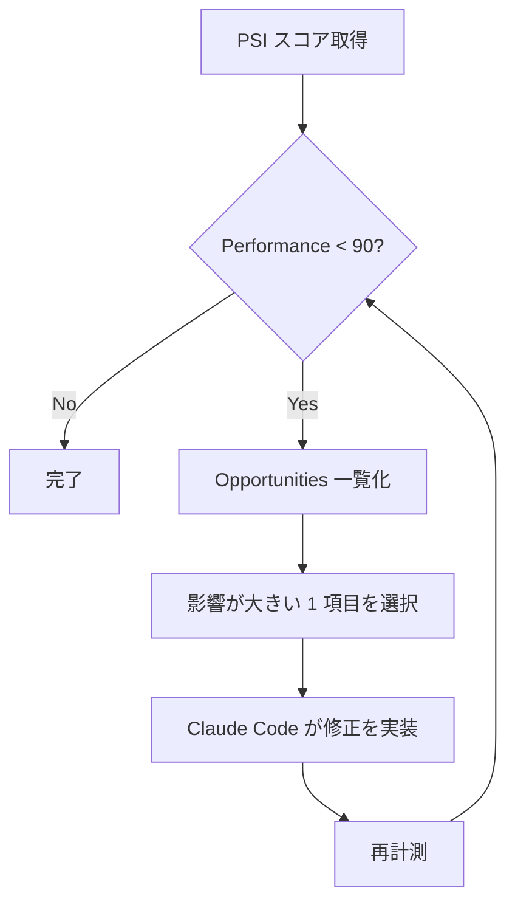

## スコアが崩れていた

Next.js で構築した EC サイトの PageSpeed Insights スコアが、機能追加のたびに少しずつ下がっていた。LCP と TBT がいずれも Lighthouse の「要改善」判定を超えていた。「後でまとめて直す」を繰り返した結果だ。

手動で Lighthouse を回す作業は地味にコストがかかる。URL を開いて、スコアを読んで、「Opportunities」を確認して、コードに戻る。この往復が面倒で後回しになっていた。MCP サーバーを介すと AI が外部 API の計測機能を直接呼べる形にできる、というのを知って試してみた。Claude Code に PSI の MCP サーバーを接続したら、スコアの取得から改善指示、コード修正まで一気通貫でできることが分かった。

## PSI MCP とセットアップ

[ruslanlap/pagespeed-insights-mcp](https://github.com/ruslanlap/pagespeed-insights-mcp) は PageSpeed Insights API をラップした MCP サーバー。チャットから「このURLのスコアを取って」と指示すると、LCP・INP・CLS・FCP・TTFB・TBT・Performance スコアが構造化データで返ってくる。「Opportunities に何がある？」と続けると優先度付きで修正候補が出てくる。

[Google Cloud Console](https://console.cloud.google.com/) で PageSpeed Insights API を有効化し API キーを発行。次に `.claude/mcp.json` に追記する:

```json:.claude/mcp.json
{
  "mcpServers": {
    "pagespeed": {
      "command": "npx",
      "args": ["-y", "pagespeed-insights-mcp"],
      "env": { "PSI_API_KEY": "<YOUR_API_KEY>" }
    }
  }
}
```

Claude Code を再起動すると `pagespeed` ツールが有効になる。

## 改善の進め方



「Opportunities を全部直して」と一度に指示すると修正が干渉し合う場合がある。1 項目ずつ修正して再計測するループを回した方が、何が効いたかが明確になる。変数を 1 つに絞って効果を検証する A/B テストの基本と同じ構造だ。

## 主な改善実装

### ヒーロー画像（LCP）

`` を `next/image` + `priority` に変えると `<link rel="preload">` が生成され LCP 要素の発見が早くなる。最初は `sizes` を省略していたが、モバイルで不必要に大きい画像を送り続けていたため追加した:

```tsx:components/HeroSection.tsx
// Before


// After
import Image from 'next/image'
<Image src="/hero.jpg" alt="hero" width={1200} height={600}
  priority sizes="(max-width: 768px) 100vw, 1200px" />
```

### フォント（FCP・LCP）

Google Fonts を `<link>` で読み込むとレンダリングブロッキングが発生する。`next/font` に切り替えるとセルフホスティングされ外部リクエストが消える:

```html
<!-- Before: _document.tsx で <link> 直書き -->
<link href="https://fonts.googleapis.com/css2?family=Noto+Sans+JP&display=swap" rel="stylesheet">
```

```tsx:app/layout.tsx
import { Noto_Sans_JP } from 'next/font/google'
const noto = Noto_Sans_JP({ subsets: ['latin'], weight: ['400', '700'], display: 'swap' })
export default function RootLayout({ children }: { children: React.ReactNode }) {
  return <html lang="ja" className={noto.className}><body>{children}</body></html>
}
```

### サードパーティスクリプト（TBT）

チャット系ウィジェットを直書きしていた。`next/script` の `lazyOnload` に変えると全リソース読み込み後に実行されメインスレッドのブロックがなくなる。TBT への影響が最も大きかった修正だった。最初は `afterInteractive` を試したがウィジェット起動がインタラクションと重なるケースがあったため変えた:

```tsx:app/layout.tsx
import Script from 'next/script'
<Script src="https://example-chat.com/widget.js" strategy="lazyOnload" />
```

### Tailwind CSS の purge（Speed Index）

`app/` ディレクトリ構成に移行した際、`tailwind.config.js` の `content` パスが古いままになっていた。パスが正しくないと purge が効かず未使用スタイルが大量に含まれる。Lighthouse の「Remove unused CSS」が Opportunities に出ていたら真っ先に疑う。

## 計測と再現性について

PSI は Google のサーバーから計測するため数値がぶれる。「1 回計測して改善された」ではなく、複数回取って傾向を見る習慣にした方が信頼性が上がる。SQL チューニングで EXPLAIN を複数回実行してウォームアップを確認するのと同じ発想で、「1 回の計測値」ではなく「計測値の分布」を見るかどうかで判断の質が変わる。

PSI MCP で計測コストが下がると「実装してすぐ確認」が自然なフローになる。継続的に計測するなら CI に組み込んで PR ごとにスコアを記録していくのが次の方向だ。

## 実装サンプル

@[github](https://github.com/liatris000/liatris-20260430-nextjs-psi-mcp)

MCP 設定テンプレートと各改善コード例を置いた。
