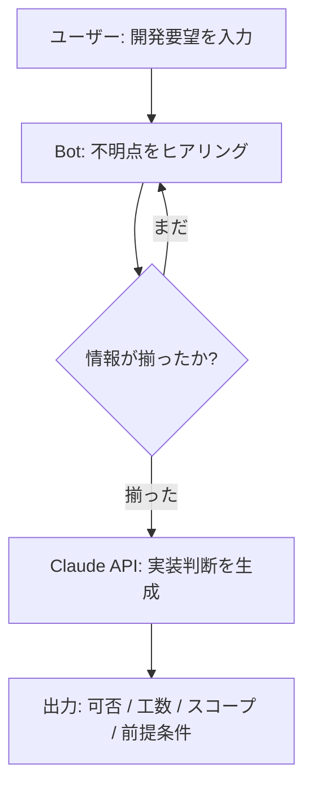

<!-- Day 1 下書き: 構成案レベル / 実装コードは Day 2 で記述 -->

## 要望を受け取ってから工数を出すまでに何が起きているか

「画面に日付をカレンダーで選べるようにしてほしい」という要望を受け取った時、
それが1時間で終わるのか、2週間かかるのかはコンテキストを聞かないと判断できない。
どんな技術スタックを使っているか、既存コンポーネントはあるか、デザイン指定はあるか。
このヒアリングを Claude API に肩代わりさせ、最後に実装可否・工数・スコープを返す Bot を作った。

## 何を作るか

Claude API のマルチターン会話を使って、要望受付 → ヒアリング → 判断出力を自動化するチャットBot。

- **入力**: ユーザーが自然言語で開発要望を投げる(1〜2文)
- **処理**: Botが不明点を最大3〜4ターンでヒアリング
- **出力**: 実装可否 / 推定工数レンジ / スコープ定義 / 前提条件リスト

成果物はPythonスクリプト(ターミナル版)と、GitHub Pages で動く HTML/JS版の2形態で用意する。

## アーキテクチャ

ヒアリングが終了したかどうかの判断は、ターン数の上限カウントではなく Claude 自身に委ねる設計にした。
理由は後述する。

## 実装(Day 2 で記述)

### System Prompt の設計

<!-- TODO Day 2: system prompt の設計方針とコード -->

### マルチターン会話ループ

<!-- TODO Day 2: messages リストに会話履歴を積む実装 -->

### 判断出力のパース

<!-- TODO Day 2: Pydantic モデルで構造化出力を受け取る方法、tool use との比較 -->

### HTML/JS 版への移植

<!-- TODO Day 2: fetch + SSE でストリーミング、GitHub Pages 対応 -->

## データアナリスト視点

要望を構造化して工数に変換するプロセスは、非構造化テキストをスキーマに落とし込む前処理と同じ構造をしている。
「何が揃えば判断できるか」を事前に定義するヒアリング設計は、分析における「何があれば意思決定できるか」を定める上流設計に相似だ。
この Bot の実装で一番時間をかけた部分も、コードではなく「判断に必要な情報の定義」だった。

## 成果物

<!-- TODO Day 2: GitHub リポジトリ URL と GitHub Pages デモ URL を記載 -->
