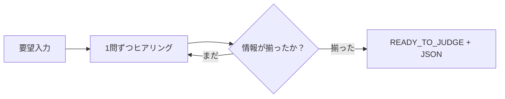

:::message
この記事は、Claude Codeを執筆支援に使った "毎朝1本書く" 取り組みの一環で書いています。

- 目的: 自分のAI活用キャッチアップ。仕組み自体も毎月アップデートしていきます
- 体制: 題材選定・実装・下書きをClaude Codeで補助、平野が動作確認と編集を経て公開判断
- 方針: Zennのガイドラインに真摯に向き合い、運営から指摘や警告があれば即座に取り組みを停止します

仕組みの全貌は[こちらの設計記事(note)](https://note.com/liatris000)にまとめています。
:::

「画面に日付をカレンダーで選べるようにしてほしい」という要望を受け取った時、それが1時間で終わるのか2週間かかるのかはコンテキストを聞かないと判断できない。技術スタック・既存コンポーネント・デザイン指定・期日。

このヒアリングを Claude API に肩代わりさせ、最後に実装可否・工数・スコープを返す Bot を作った。

## 何を作るか

Claude API のマルチターン会話で「要望受付 → ヒアリング → 判断出力」を自動化するチャットBot。

- **入力**: 自然言語で開発要望を投げる
- **処理**: 1 問ずつヒアリング（最大 4 ターン）
- **出力**: 実装可否 / 推定工数レンジ / スコープ / 前提条件

成果物は Python CLI 版と GitHub Pages で動く HTML/JS 版の 2 形態で用意した。



## System Prompt の設計

最初に試したのは「4 ターン以内に収めてください」という指示だった。Bot がターン数を意識するあまり 1 ターン目から複数の質問を一気に投げてくる問題が出た。

採用したのは**終了条件をターン数ではなく「判断可能になったか」で定義する**方針だ。

```python:bot.py
SYSTEM_PROMPT = """\
あなたは経験豊富なソフトウェアエンジニアリングコンサルタントです。
実装判断に必要な情報を 1 問ずつヒアリングし、
情報が揃ったら [READY_TO_JUDGE] マーカーに続けて JSON を出力してください。

確認する優先順:
- 技術スタック・既存システムの状況
- Done の定義
- デザイン・UI の制約
- セキュリティ・権限要件、期日

1 ターンに 1 つの質問だけ投げる。
"""
```

「1 問ずつ」という制約が効いた。複数質問を一度に受けると回答が浅くなりやすい。1 問限定にすることで Bot 側も「何を一番知りたいか」を優先順位づけするようになる。

## マルチターン会話ループ

`messages` リストに `user` と `assistant` を交互に積んでいくだけだ。

```python:bot.py
messages: list[dict] = []
messages.append({"role": "user", "content": user_input})

for _ in range(MAX_TURNS):
    response = client.messages.create(
        model="claude-sonnet-4-6",
        max_tokens=1024,
        system=SYSTEM_PROMPT,
        messages=messages,
    )
    assistant_text = response.content[0].text
    messages.append({"role": "assistant", "content": assistant_text})

    if READY_MARKER in assistant_text:
        print_judgment(parse_judgment(assistant_text))
        return

    user_input = input("あなた: ").strip()
    messages.append({"role": "user", "content": user_input})
```

## 判断出力のパース

Claude に構造化データを返させる方法は Tool Use とマーカー方式の 2 択だった。

| 方法 | 実装コスト | 会話の自然さ |
|------|------------|--------------|
| `[READY_TO_JUDGE]` + JSON | 低 | 判断前に日本語コメントも出せる |
| Tool Use | やや高 | JSON スキーマを強制できる |

今回はマーカー方式にした。判断直前に「情報が揃いましたので整理します」のような一言を自然に添えられる点が決め手だ。

```python:bot.py
def parse_judgment(text: str) -> dict | None:
    idx = text.find(READY_MARKER)
    if idx == -1:
        return None
    raw = text[idx + len(READY_MARKER):].strip()
    # ```json ... ``` で囲まれる場合があるので除去
    if raw.startswith("```"):
        raw = raw.split("```")[1]
        if raw.startswith("json"):
            raw = raw[4:]
    try:
        return json.loads(raw.strip())
    except json.JSONDecodeError:
        return {"raw": raw}
```

コードブロック除去は実際に必要だった。Claude は JSON をそのまま出す場合と ```` ```json ```` で囲む場合が混在する。

## HTML/JS 版の注意点

GitHub Pages はサーバーレスなので Anthropic API を `fetch` で直接叩く構成にした。ブラウザからの直接アクセスには専用ヘッダーが必要だ。

```javascript
headers: {
  "anthropic-dangerous-direct-browser-access": "true",
  // ...
}
```

個人デモ用途ならこれで動く。プロダクション用途ではバックエンドプロキシを挟むのが望ましい。

## データアナリスト視点

要望を構造化して工数に変換するプロセスは、非構造化テキストをスキーマに落とし込む前処理と同じ構造をしている。「何が揃えば判断できるか」を事前に定義するヒアリング設計は、分析における「何があれば意思決定できるか」を定める上流設計に相似だ。  
この Bot で一番時間をかけたのも、コードではなく「判断に必要な情報の定義」だった。

## 成果物

@[github](https://github.com/liatris000/liatris-20260504-dev-intake-bot)

判断の精度は system prompt の設計次第で大きく変わる。今の実装は汎用設計だが、特定領域（SaaS 連携 / データ基盤構築など）向けにチューニングすれば、より精度の高い判断が出るはずだ。
