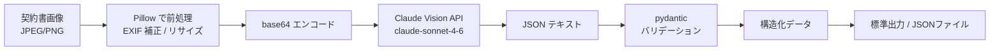

:::message
この記事は、Claude Codeを執筆支援に使った "毎朝1本書く" 取り組みの一環で書いています。

- 目的: 自分のAI活用キャッチアップ。仕組み自体も毎月アップデートしていきます
- 体制: 題材選定・実装・下書きをClaude Codeで補助、平野が動作確認と編集を経て公開判断
- 方針: Zennのガイドラインに真摯に向き合い、運営から指摘や警告があれば即座に取り組みを停止します

仕組みの全貌は[こちらの設計記事](https://zenn.dev/liatris/articles/20260701-zenn-kickoff)にまとめています。
:::

紙の契約書をスキャンして手入力するフローは、転記ミスが起きやすい上に単純作業として時間を食う。Claude の Vision 機能を使えば、スキャン画像から記入済みフィールドを読み取り、そのまま構造化データとして出力できる。

この記事では、Python から Claude API を呼んで「画像 → JSON」の変換パイプラインを動かすところまでを実装する。最終的な出力は pydantic モデルでバリデーションをかけた辞書で、後続の DB 書き込みや CSV 生成にそのまま渡せる形にした。

## アーキテクチャ



入力は JPEG か PNG のスキャン画像。Pillow で前処理してから base64 にエンコードし、Claude Vision API に渡す。レスポンスは自然言語テキストだが、JSON のみ出力するよう指示することで pydantic モデルに落とし込める。

## 実装

### 1. 環境準備

```bash
pip install anthropic pydantic Pillow
export ANTHROPIC_API_KEY="your-api-key"
```

`requirements.txt` として管理する場合:

```text:requirements.txt
anthropic>=0.40.0
pydantic>=2.0.0
Pillow>=10.0.0
```

### 2. pydantic モデルの定義

まずスキーマを決める。`confidence_note` を optional にしておくことで、Claude が「このフィールドは読み取りが不確か」と注記できる余地を作った。

```python:contract_ocr.py
from pydantic import BaseModel

class ContractFields(BaseModel):
    fields: dict[str, str | None]
    confidence_note: str | None = None
```

### 3. 画像の前処理

スマホで撮影したスキャン画像は EXIF に回転情報が入っているが、PIL でそのまま開くと向きが崩れる。`_getexif()` で orientation タグを拾い、回転を補正する。

```python:contract_ocr.py
import io
import base64
from pathlib import Path
from PIL import Image

def preprocess_image(image_path: Path, max_size: int = 2048) -> tuple[bytes, str]:
    """EXIF 回転補正・リサイズを行い (バイト列, MIME タイプ) を返す"""
    with Image.open(image_path) as img:
        exif_data = getattr(img, "_getexif", lambda: None)()
        if exif_data:
            orientation = exif_data.get(274)
            rotation_map = {3: 180, 6: 270, 8: 90}
            if orientation in rotation_map:
                img = img.rotate(rotation_map[orientation], expand=True)

        if max(img.size) > max_size:
            img.thumbnail((max_size, max_size), Image.LANCZOS)

        if img.mode not in ("RGB", "L"):
            img = img.convert("RGB")

        buffer = io.BytesIO()
        fmt = "JPEG" if image_path.suffix.lower() in (".jpg", ".jpeg") else "PNG"
        img.save(buffer, format=fmt)
        return buffer.getvalue(), f"image/{'jpeg' if fmt == 'JPEG' else 'png'}"
```

最大サイズを 2048px に設定しているのは、それ以上大きくしても Claude の精度はほぼ変わらず API コストだけが上がったため。

### 4. プロンプト設計

「空欄を埋める」のではなく「記入済みの値を読み取る」ことをシステムプロンプトで明確にする点がポイントだった。最初は user メッセージだけで指示していたが、JSON しか返さないという制約を system に移したら安定した。

```python:contract_ocr.py
def build_prompt(field_names: list[str]) -> str:
    fields_list = "\n".join(f"- {name}" for name in field_names)
    return (
        f"以下のフィールドの記入済みの値を読み取り、JSON のみで出力してください。"
        f" 値が空欄または判読不能な場合は null を返してください。余計な説明は不要です。\n\n"
        f"フィールドリスト:\n{fields_list}\n\n"
        f"出力形式:\n"
        f'{{"fields": {{"フィールド名": "値 or null"}}, '
        f'"confidence_note": "読み取りに不確かな点があれば簡潔に記載（なければ null）"}}'
    )
```

tool_use で JSON スキーマを強制する方法も試したが、Vision API との組み合わせでレイテンシが増えた割にエラーレートが変わらなかった。プロンプトで `JSON のみ` と指示する方式でほぼ安定して動く。

### 5. Claude API 呼び出しと pydantic バリデーション

```python:contract_ocr.py
import json
import anthropic
from pydantic import ValidationError

def clean_json_response(raw: str) -> str:
    """```json ... ``` ブロック記法を除去する"""
    raw = raw.strip()
    if raw.startswith("```"):
        lines = raw.split("\n")
        inner, in_block = [], False
        for line in lines:
            if line.startswith("```") and not in_block:
                in_block = True
                continue
            if line.startswith("```") and in_block:
                break
            if in_block:
                inner.append(line)
        raw = "\n".join(inner)
    return raw.strip()

def extract_fields(image_path: Path, field_names: list[str]) -> ContractFields:
    client = anthropic.Anthropic()
    image_bytes, mime_type = preprocess_image(image_path)
    b64_image = base64.standard_b64encode(image_bytes).decode()

    response = client.messages.create(
        model="claude-sonnet-4-6",
        max_tokens=1024,
        system=(
            "あなたは文書解析の専門家です。"
            "契約書フォームの画像から記入済みフィールドの値を正確に読み取ります。"
        ),
        messages=[
            {
                "role": "user",
                "content": [
                    {
                        "type": "image",
                        "source": {
                            "type": "base64",
                            "media_type": mime_type,
                            "data": b64_image,
                        },
                    },
                    {"type": "text", "text": build_prompt(field_names)},
                ],
            }
        ],
    )

    raw_text = response.content[0].text
    clean_text = clean_json_response(raw_text)

    try:
        parsed = json.loads(clean_text)
    except json.JSONDecodeError as e:
        raise ValueError(f"JSON パース失敗: {e}\n\n生テキスト:\n{raw_text}") from e

    return ContractFields.model_validate(parsed)
```

バリデーションエラーが出た場合は呼び出し元でキャッチして別ファイルに退避する設計にしている。型エラーが残る行を「要確認リスト」として保持しておくと、後から人手でチェックする際に絞り込みやすい。

### 6. CLI エントリポイント(完全版)

```python:contract_ocr.py
import argparse
import sys

DEFAULT_FIELDS = [
    "氏名", "住所", "電話番号", "メールアドレス",
    "契約日", "契約期間", "金額", "署名",
]

def main() -> None:
    parser = argparse.ArgumentParser(
        description="Claude Vision で契約書フォームを解析し JSON で出力する"
    )
    parser.add_argument("image", type=Path, help="契約書画像ファイル (JPEG / PNG)")
    parser.add_argument(
        "--fields", type=Path, default=None,
        help="フィールド名のリストを持つ JSON ファイル (省略時はデフォルト 8 項目)"
    )
    parser.add_argument(
        "--output", type=Path, default=None,
        help="結果を保存する JSON ファイルパス (省略時は標準出力)"
    )
    args = parser.parse_args()

    if not args.image.exists():
        print(f"❌ 画像ファイルが見つかりません: {args.image}", file=sys.stderr)
        sys.exit(1)

    field_names = DEFAULT_FIELDS
    if args.fields:
        with open(args.fields, encoding="utf-8") as f:
            field_names = json.load(f)

    print(f"🔍 解析中: {args.image.name}  ({len(field_names)} フィールド)", file=sys.stderr)

    try:
        result = extract_fields(args.image, field_names)
    except (ValueError, ValidationError) as e:
        print(f"❌ エラー: {e}", file=sys.stderr)
        sys.exit(1)

    output_data = result.model_dump()

    if args.output:
        args.output.parent.mkdir(parents=True, exist_ok=True)
        with open(args.output, "w", encoding="utf-8") as f:
            json.dump(output_data, f, ensure_ascii=False, indent=2)
        print(f"✅ 結果を保存: {args.output}", file=sys.stderr)
    else:
        print(json.dumps(output_data, ensure_ascii=False, indent=2))

if __name__ == "__main__":
    main()
```

## 実行例

```bash
python contract_ocr.py scan.jpg
```

```json
{
  "fields": {
    "氏名": "山田 太郎",
    "住所": "東京都渋谷区〇〇町1-2-3",
    "電話番号": "03-0000-0000",
    "メールアドレス": "yamada@example.com",
    "契約日": "2026年5月18日",
    "契約期間": "2026年6月1日〜2027年5月31日",
    "金額": "月額 50,000円（税込）",
    "署名": "山田 太郎"
  },
  "confidence_note": null
}
```

フィールド定義を JSON ファイルで渡せば、任意の契約書フォーマットに対応できる。

```json:my_fields.json
["会社名", "担当者名", "発注番号", "納期", "発注金額（税抜）"]
```

```bash
python contract_ocr.py purchase_order.jpg --fields my_fields.json --output result.json
```

## データアナリスト視点

OCR で抽出した文字列を構造化するプロセスは、SQL の集計前に生ログを正規化する ETL 工程と構造が同じだ。どのフィールドが信頼できるか、どのフィールドは人手確認が必要かを pydantic スキーマの段階で決めておかないと、後段のクエリで毎回 `CASE WHEN` が増えていく。バリデーションエラーをそのまま「要確認フラグ」として DB に保持する設計は、データ基盤の `NULL` 扱いポリシーそのものだ。

Claude の `confidence_note` フィールドも同じ発想で設けた。人間が後から読んでも「どのフィールドが不確かだったか」が追えるようにしておく。精度を上げることと、精度の境界を明示することは別の仕事だ。
