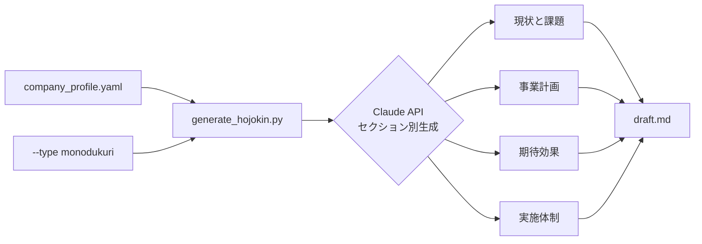

:::message
この記事は、Claude Codeを執筆支援に使った "毎朝1本書く" 取り組みの一環で書いています。

- 目的: 自分のAI活用キャッチアップ。仕組み自体も毎月アップデートしていきます
- 体制: 題材選定・実装・下書きをClaude Codeで補助、平野が動作確認と編集を経て公開判断
- 方針: Zennのガイドラインに真摯に向き合い、運営から指摘や警告があれば即座に取り組みを停止します

仕組みの全貌は[こちらの設計記事(note)](https://note.com/liatris)にまとめています。
:::

補助金申請書類の「現状と課題」「実施内容」「期待効果」は、毎回同じ構造なのに毎回ゼロから書いている。事業者ごとに変わるのは業種・規模・課題の中身だけで、文書の骨格は同じだ。Claude API を使って、この繰り返し作業を CLI ツールで自動化してみた。

## 補助金申請書類の構造を理解する

ものづくり補助金・IT導入補助金・小規模事業者持続化補助金など、代表的な補助金の申請書類には共通のセクション構造がある。

| セクション | 内容 | 文字数の目安 |
|---|---|---|
| 現状と課題 | 事業の現状と解決すべき課題 | 300〜400字 |
| 事業計画・実施内容 | 補助金で実施する取り組みの詳細 | 500〜800字 |
| 期待される効果 | 取り組みによって期待される成果 | 200〜400字 |
| 実施体制 | 誰が実施するか、外部リソースの活用 | 150〜200字 |

補助金ごとに文字数制限や評価基準は異なるが、この4つのセクションはほぼ必ずある。「変わる部分」（事業者情報と補助金の種類）と「変わらない部分」（セクション構造とプロンプト）を分離すると、自動化の余地が見えてくる。

## アーキテクチャ

入力は3つ：会社情報 YAML・補助金の種類・事業概要（YAML 内に自由テキストで記述）。



最初は1プロンプトで全セクションを一度に生成しようとした。試してみると「現状と課題」と「期待効果」の内容が重複し、審査官目線では冗長な文章が出力された。セクション分割して個別に生成する方式に切り替えたところ、各セクションの論点が整理されて質が上がった。

## 実装: 入力形式の設計

会社情報は YAML で受け取る。固有名詞（会社名・担当者名）を含めない設計にした。Claude API に送信する情報を「業種・規模・課題の種別」に限定することで、個人情報を API に渡さず済む。

```yaml
# company_profile.yaml
industry: "製造業（金属部品加工）"
employees: 25
main_challenge: |
  手作業による品質検査工程が全工数の約40%を占めており、
  検査員の習熟度差による判定ばらつきが課題となっている。
initiative: |
  AIを活用した外観検査システムの導入。
  カメラ画像から不良品を自動判定し、検査工数を削減する。
expected_outcome: |
  検査工数の大幅削減と判定精度の均一化。
  不良品の出荷率低減および受注対応力の向上。
```

## 実装: プロンプト設計

補助金申請書類には「審査官が読む」という特性がある。system prompt に審査官視点を明示的に持たせると、生成文の説得力が変わる。

```python
SYSTEM_PROMPT = """あなたは補助金申請書類の作成支援の専門家です。
中小企業診断士の視点を持ち、補助金審査官が重視するポイントを熟知しています。

補助金審査官が重視するポイント:
- 事業の革新性・独自性
- 実現可能性（体制・スケジュール・予算の妥当性）
- 政策目標への貢献度
- 継続性・発展性

生成する文章は審査官が読むことを意識した説得力のある文体で記述してください。
事業者の固有名詞（会社名・担当者名）は含めないでください。"""
```

各セクションのプロンプトには「執筆の要点」と「文字数目安」を渡す。こうすることで、セクションごとに焦点がブレない。

## 実装: Python スクリプト

```python
#!/usr/bin/env python3
import argparse
import sys
import yaml
from anthropic import Anthropic

SUBSIDY_TYPES = {
    "monodukuri": "ものづくり補助金",
    "it_donyu": "IT導入補助金",
    "shoukibo": "小規模事業者持続化補助金",
}

SECTIONS = [
    {
        "title": "現状と課題",
        "prompt_hint": "事業者の現状における具体的な課題を記述。補助金の必要性を示す根拠として機能させること。",
        "max_chars": 400,
    },
    {
        "title": "事業計画・実施内容",
        "prompt_hint": "補助金を活用して実施する具体的な取り組みを記述。実現可能性と革新性を示すこと。",
        "max_chars": 600,
    },
    {
        "title": "期待される効果",
        "prompt_hint": "定量・定性的な効果を記述。審査官が評価しやすい形で整理すること。",
        "max_chars": 300,
    },
    {
        "title": "実施体制",
        "prompt_hint": "誰が中心となって実施するか、外部リソースをどう活用するかを記述。",
        "max_chars": 200,
    },
]

SYSTEM_PROMPT = """あなたは補助金申請書類の作成支援の専門家です。
...(省略: 上記の SYSTEM_PROMPT を参照)..."""


def build_section_prompt(section: dict, profile: dict, subsidy_name: str) -> str:
    return f"""以下の事業者情報と補助金の種類に基づいて、「{section['title']}」セクションを生成してください。

【補助金の種類】{subsidy_name}
【業種】{profile.get('industry', '')}
【従業員規模】{profile.get('employees', '')}名
【主要な課題】{profile.get('main_challenge', '')}
【実施したいこと】{profile.get('initiative', '')}
【期待する成果】{profile.get('expected_outcome', '')}

【執筆の要点】{section['prompt_hint']}
【文字数】{section['max_chars']}字程度"""


def generate_section(client: Anthropic, section: dict, profile: dict, subsidy_name: str) -> str:
    response = client.messages.create(
        model="claude-opus-4-5",
        max_tokens=1024,
        system=SYSTEM_PROMPT,
        messages=[{"role": "user", "content": build_section_prompt(section, profile, subsidy_name)}],
    )
    return response.content[0].text.strip()


def main():
    parser = argparse.ArgumentParser(description="補助金申請書類ドラフトを Claude API で自動生成する")
    parser.add_argument("--profile", required=True)
    parser.add_argument("--type", required=True, choices=list(SUBSIDY_TYPES.keys()))
    parser.add_argument("--output", default="draft.md")
    args = parser.parse_args()

    profile = yaml.safe_load(open(args.profile, encoding="utf-8"))
    subsidy_name = SUBSIDY_TYPES[args.type]
    client = Anthropic()  # ANTHROPIC_API_KEY を自動で読む

    lines = [f"# {subsidy_name} 申請書類ドラフト\n"]
    for section in SECTIONS:
        print(f"  生成中: {section['title']} ...", file=sys.stderr)
        text = generate_section(client, section, profile, subsidy_name)
        lines.append(f"## {section['title']}\n\n{text}\n")

    with open(args.output, "w", encoding="utf-8") as f:
        f.write("\n".join(lines))
    print(f"\n✅ 出力完了: {args.output}", file=sys.stderr)


if __name__ == "__main__":
    main()
```

セットアップと実行:

```bash
pip install anthropic pyyaml
export ANTHROPIC_API_KEY="sk-ant-..."

python generate_hojokin.py \
  --profile company_profile.yaml \
  --type monodukuri \
  --output draft.md
```

## サンプル出力

製造業（金属部品加工）のケースで生成した「現状と課題」セクションの例:

```markdown
## 現状と課題

当社は金属部品加工を主力事業として展開しており、製造業の生産性向上に貢献してきた。
しかし近年、受注増加に伴い品質検査工程の非効率性が顕在化している。

現在、品質検査は熟練検査員による目視・手作業に依存しており、検査工程が全製造工数の
約40%を占める状況となっている。検査員間の習熟度差により同一製品に対する判定結果が
ばらつくケースが見られ、品質の均一化が困難な状態にある。また、検査員の確保・育成に
多大なコストと時間を要しており、急激な受注増への柔軟な対応が制約されている。

このような状況を打開するため、AI技術を活用した外観検査システムの導入が急務となっている。
```

生成後の必須作業として、実際の数値（現在の不良率・目標値など）を根拠ある数字に置き換えること。フィクションの数値を申請書類に使うのは事実と異なる記載になるため、必ず実測値・目標値に差し替える。

## データアナリスト視点から見ると

申請書類の生成フローは、構造化データを非構造化テキストに変換するパイプラインとして整理できる。入力（会社情報 YAML）が抽出層、セクション定義とプロンプトがトランスフォーム層、出力 Markdown がロード先に対応する。補助金の種類が変わってもトランスフォーム層（プロンプトテンプレート）を差し替えるだけで対応できるため、スキーマが安定していれば拡張コストが低い。

---

セクション分割生成にたどり着くまでに、一発生成・2分割・4分割と3パターン試した。4分割がもっともセクション間の重複が少なく、読み手（審査官）が評価しやすい構成になった。申請書類に限らず、長文書類の構造が決まっているケースではセクション分割生成が効く可能性がある。
