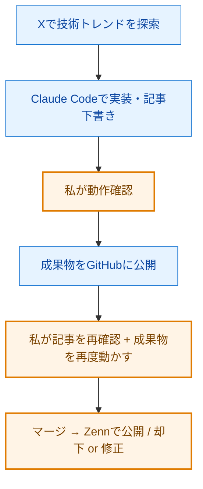

こんにちは。Zenn で技術記事を書いている liatris です。

明日から、Claude Code を執筆支援として使いながら、公開可能な小さな実験を継続的に記事化する取り組みを始めます。今日はその背景と設計を、最初の記事として残しておきます。

## 読み手として、ずっと思っていたこと

私は AI 活用やツール作りの記事を読むのが好きで、Zenn や個人ブログの「○○を作ってみた」「○○を試してみた」発信を日常的に追っています。コードまで丁寧に公開してくれている記事にはいつも助けられています。

そのうえで、自分が読み手として一番うれしいのは「実装まで全部見える記事」だな、とも思っていました。

- どんなプロンプトを投げたのか
- どんなライブラリを、どんな順番で組み合わせたのか
- どこでハマって、どう抜けたのか
- リポジトリは公開されているのか

ここまで揃っていると、自分の手元で再現できます。動かして、いじって、自分のものにできる。これは誰かを責めたい話ではなく、単純に自分はそういう記事を増やしたい、という好みの問題です。

書く側に立ってみると、公開しづらい事情があるのもよく分かります。実務で作っているツールには社内データや認証情報、固有の業務文脈が絡んでいて、そのまま GitHub には上げられない。整理して機微情報を抜く時間がなければ「デモとスクショだけ」になるのは自然なことです。

だったら、最初から公開前提の小さなものを自分で積み重ねればいい。実務のツールはそのまま出せなくても、「公開できる小さな実験」なら短い時間でやれる。それが今回の発想です。

そしてもう一段踏み込むなら、改善サイクルそのものを open にしたい。記事の中身だけでなく、「どんなプロンプトを使って」「どこで失敗して」「次にどう直すか」まで全部見せていく。それがこの記事と、これから始める運用ログ（Zenn スクラップ）の役割です。

## 仕組みの全体像

発信を 3 つの役割に分けています。

- **Zenn スクラップ（運用ログ）**: AI エージェント（Claude Code）が自律的に動く際の、ターミナルでの生々しい試行錯誤（エラーとリトライ）のログや、日々の実験プロセス。
- **Zenn 記事（成果物）**: 実験の成果物。コードと解説。あわせて、月単位の振り返り（何が効いて何が効かなかったか）も定期的に Zenn 記事として出します。
- **この記事（設計）**: 仕組みの設計思想そのもの。最初に意図を書いておくための記事です。



水色のノード（A, B, D）が Claude Code に任せる作業、オレンジ（C, E, F）が私が手を動かす作業です。図では PR・通知・スケジュールの細部は省いていますが、内部的には GitHub の PR レビューを通して公開判断する仕組みになっています。

成果物は記事ごとに `https://github.com/liatris000/liatris-YYYYMMDD-テーマ名` に公開し、HTML 系成果物は GitHub Pages でも触れる状態にします。私のところには「PR ができたよ」という通知が届くので、内容を確認してマージ＝Zenn 公開、というフローです。

## 設計で「ここは譲れない」と決めたこと

### 1. 成果物のコード・設定一式を必ず GitHub に公開する

「コードが見えない問題」を、自分の記事ではゼロにします。コードの全文は GitHub リポジトリで公開し、記事内ではその核心となるロジックや、特に工夫した部分を抜粋して解説します。記事を読みながら構造が理解でき、詳細が知りたければリポジトリへ、という動線を徹底します。

### 2. 架空の機能・未確認のリリース情報を使わない

AI の提案は、必ず一次情報で確認する。プロンプトにも「存在確認できていない機能名・製品名を題材にしない」と明記しています。

### 3. 公開判断は必ず人間がする

PR 作成までは自動化しても、マージは私が押す。可能な限り、マージ前にコードを実際に動かしてから公開します。

そして、スケジュールが毎日でも、公開が毎日になるとは限りません。題材がしっくり来ない日、検証で問題が出た日は見送ります。「毎朝」は私のチェック頻度であって、読者への発信頻度ではありません。

## 何のためにやるのか（自分のキャッチアップ）

この取り組みの一番の目的は、自分の AI 活用キャッチアップです。Claude Code を毎日使い込みながら、エージェントに何をどこまで任せられるのか、どこで人間の判断が要るのかを、手を動かして掴んでいく。記事はその副産物であり、同時に「学んだことを公開して検証にさらす」ための装置でもあります。

なので、仮に読者がほとんどつかなくても構わないと思っています。自分の学習が前に進むなら、それだけで続ける理由になる。公開はあくまで、自分を甘やかさないための仕掛けくらいに捉えています。

データアナリストとしての視点で言うと、これは自分の学習プロセスに計測ログを残す作業に近いです。最初に出すシンプルな記事と、しばらく運用した後の記事を並べれば、キャッチアップが進んだかどうかが差分として見える。育てる過程そのものを残しておきたいんです。

## Zenn のガイドラインへの姿勢

Zenn は「人が主体となって情報を発信する場」というスタンスを取っており、生成 AI によるコンテンツの乱造は禁止されています。私もこのスタンスに同意しています。本記事の仕組みは、AI を執筆支援として使いつつ、題材選定・公開判断・内容検証は私自身が担う前提で設計しています。

もし運営から指摘や警告があれば、即座に取り組みを停止します。乱造に見えないように作ったつもりですが、ガイドラインの解釈は運営の判断が最終で、私はそれに従います。

## 早速ハマった話：自動レビューを鵜呑みにすると誤情報が混ざる

実験の前段で、Zenn にある AI 自動レビュー機能を活用してみました。すると返ってきたコメントの中に「`.claudeignore` というファイルを使えば、Claude に `.env` を読ませない設定ができる」という提案がありました。

説得力のある書き方だったのですが、念のため公式情報を確認したところ、`.claudeignore` は Claude Code 公式の機能ではありませんでした（2026 年 7 月時点。Feature Request として GitHub Issue には上がっていますが、実装はされていません）。Claude Code の公式な方法は `.claude/settings.json` の `permissions.deny` 設定です。

```json:.claude/settings.json
{
  "permissions": {
    "deny": [
      "Read(.env)",
      "Read(.env.*)",
      "Read(secrets/**)"
    ]
  }
}
```

`deny` に列挙したパスは Claude が読み取り・編集できなくなります。パターンは gitignore 仕様に準拠し、`Read` のほか `Edit` / `Write` にも同じ書き方が使えます。

これを鵜呑みにしていたら、読者を誤った情報に誘導していたところでした。プロンプトに「自動レビューコメントは検証なしに反映しない。"〜があれば" のような不確実な指摘は公式ドキュメントで一次情報を確認」というルールを追記しました。

「AI が下書きし、AI がレビューし、人間が公開判断する」3 層構造の中で、AI 同士の閉じたループに人間の検証を必ず挟むことの重要性を、運用初日から学べました。

## 育てながら出していく

### 初日から完璧ではない

正直に言うと、最初は普通にショボい記事も出ると思います。Claude Code をスケジュール実行で動かす都合上、最初は比較的シンプルなテーマからになるし、題材選定がうまくいかない日、ハルシネーションが混ざる日もあるはずです。

それでも実験を始めるのは、Claude Code を使い込みながらキャッチアップして、仕組み自体を段階的にアップデートしていくことを前提にしているからです。

### 自分自身に課す 3 つのルール

- **まずは出していくこと**: 最初から完成度を求めすぎると、たぶん続かない。動かさなければ改善する対象すら見えてこない。
- **ただ出すのではなく、実際に試すこと**: 目視で読むだけでなく、コードを動かして確認する。
- **フィードバックも記事にすること**: 気づきと修正を Zenn スクラップに残し、節目には振り返り記事として発信する。閉じたループにしない。

### 今、考えているアップデート案

具体案を 1 つだけ書き残しておきます。

**ルーティンを分割する**: いまは `routines` で「題材スキャン → 実装 → 記事執筆」を一気にやっていますが、これを「①調査」「②開発」「③記事作成」の 3 つのステップに分けることを考えています。各ステップで個別にコンテキストを最適化できるし、フィードバックも局所的に与えられる。実行コストは 3 倍ですが、質は大きく変わるはずです。

題材のスコアリング、ハマりどころの構造化など他にもアイデアはありますが、1 つずつ試して効果を見て、効くものだけ採用するつもりです。日々の修正ログは Zenn スクラップ、月単位の振り返りは Zenn 記事として発信していきます。

最初に出るシンプルな記事と、半年後に出る記事のレベルが違っていたら、それはこのフィードバックループが機能した証拠です。育てる過程そのものが、AI エージェント運用の実験ログになる——それがこの実験のもう一つの楽しみです。

## そして、自分の言葉でも書いていく

ここまで書いた自動化は「実装まで見える記事を、止まらず継続的に出す」ためのレールです。それとは別に、普段作っているもの（自動化、データ周りの工夫、ちょっとした Web アプリなど）については、自分の言葉で書いていきたいと思っています。なぜ作ったか、何を選んで何を捨てたか、設計の意図と試行錯誤——そこまで含めて書く予定です。

「AI を支援に書く」と「自分の言葉で深掘りする」の両輪で、"見える発信" を増やしていきます。

## おわりに

明日から、Zenn の zenn.dev/liatris で記事の投稿を始めます。

それではまた、運用ログでお会いしましょう。

### 関連リンク

- 投稿先: https://zenn.dev/liatris
- 運用ログ（Zenn スクラップ）: （公開後に追記）
- Zenn 記事の管理リポジトリ: https://github.com/liatris000/zenn_create
- Zenn コミュニティガイドライン: https://zenn.dev/guideline
- Zenn 利用規約: https://zenn.dev/terms
- Zenn「コンテンツの執筆における生成 AI の利用について」（2026 年 3 月 10 日）: https://info.zenn.dev/2026-03-10-ai-contents-guideline
