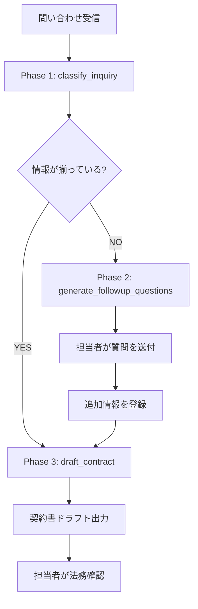

:::message
この記事は、Claude Codeを執筆支援に使った "毎朝1本書く" 取り組みの一環で書いています。

- 目的: 自分のAI活用キャッチアップ。仕組み自体も毎月アップデートしていきます
- 体制: 題材選定・実装・下書きをClaude Codeで補助、平野が動作確認と編集を経て公開判断
- 方針: Zennのガイドラインに真摯に向き合い、運営から指摘や警告があれば即座に取り組みを停止します

仕組みの全貌は[こちらの設計記事](https://zenn.dev/liatris/articles/20260701-zenn-kickoff)にまとめています。
:::

問い合わせが届くたびに、読んで・転記して・確認して・テンプレを探して……という流れがどのチームでも固定化している。ツールを増やすたびに「どこに情報が落ちているか」が増えていく。

Claude API を使ってこのフロー全体をパイプライン化できないか検証した。分類・追加情報収集・契約書生成を 1 フローに収めつつ、「自動化しすぎない」設計を実現するのがゴール。

---

## パイプラインの全体像

3 フェーズで処理する:



1. **分類フェーズ** — 種別・優先度・業種をタグ付け、不足情報を特定
2. **収集フェーズ** — 担当者が追加情報を確認・登録(ここだけ人間が介在)
3. **生成フェーズ** — 情報が揃ったら契約書ドラフトを生成

状態は SQLite に記録し、各フェーズ間の遷移をログとして残す。

---

## `tool_use` をどう使うか、そしてなぜか

最初はプロンプトで JSON を返させていた。が、フォーマット崩れが頻発した。特に「missing_info が空配列か、そもそもキーが出てこないか」の判定が不安定で、フェーズ遷移の判断に使えない。

`tool_use` に切り替えると、構造が保証される。Claude が「このツールを呼び出す」という形式で返答するため、JSON の整形不備が原因のエラーがなくなった。

```python:pipeline.py
CLASSIFY_TOOL = {
    "name": "classify_inquiry",
    "description": "問い合わせテキストを分類し、種別・優先度・業種を返す",
    "input_schema": {
        "type": "object",
        "properties": {
            "inquiry_type": {
                "type": "string",
                "enum": ["product_inquiry", "support", "partnership", "other"]
            },
            "priority": {
                "type": "string",
                "enum": ["high", "medium", "low"]
            },
            "industry": {
                "type": "string",
                "description": "推定業種 (例: 小売, 製造, IT, 医療など)"
            },
            "missing_info": {
                "type": "array",
                "items": {"type": "string"},
                "description": "契約書作成に不足している情報のリスト"
            }
        },
        "required": ["inquiry_type", "priority", "industry", "missing_info"]
    }
}
```

`tool_choice={"type": "tool", "name": "classify_inquiry"}` で強制呼び出しにしている。`auto` のままだと Claude がテキスト回答を選ぶ場合があるため。

3 つのフェーズに対応するツールを定義した:

- `classify_inquiry` — 種別・優先度・業種 + 不足情報のリストを返す
- `generate_followup_questions` — 担当者が相手先に送る質問リストを返す
- `draft_contract` — 契約書ドラフト本文と担当者向け注意事項を返す

---

## セットアップと動かし方

```bash
pip install anthropic
export ANTHROPIC_API_KEY="your-api-key"
```

```bash
# Phase 1: 問い合わせを分類
python pipeline.py classify "ECサイトのリニューアルについて見積もりをお願いしたい。予算はまだ未定です。"
# → inquiry_id = 1, status: needs_info

# Phase 2: 質問テンプレートを生成
python pipeline.py followup 1
# → 確認事項リストを表示。担当者がこれを相手先にメールする

# 追加情報を受け取ったら登録
python pipeline.py update 1 "会社名: 株式会社サンプル / 予算: 300万円 / 納期: 3ヶ月 / 決済機能なし"

# Phase 3: 契約書ドラフト生成
python pipeline.py draft 1
# → contract_draft_1.md を出力
```

Phase 2 の質問生成と追加情報登録は人間が介在するステップ。ここを自動化しないのが設計の肝。

---

## 全体コード

```python:pipeline.py
import os, sys, sqlite3
from datetime import datetime
from pathlib import Path
import anthropic

DB_PATH = Path("pipeline.db")
MODEL = "claude-opus-4-8"
client = anthropic.Anthropic(api_key=os.environ["ANTHROPIC_API_KEY"])


def init_db(conn):
    conn.execute("""
        CREATE TABLE IF NOT EXISTS inquiries (
            id         INTEGER PRIMARY KEY AUTOINCREMENT,
            text       TEXT    NOT NULL,
            type       TEXT,
            priority   TEXT,
            industry   TEXT,
            status     TEXT    NOT NULL DEFAULT 'received',
            followup   TEXT,
            contract   TEXT,
            created_at TEXT    NOT NULL,
            updated_at TEXT    NOT NULL
        )
    """)
    conn.commit()


def get_conn():
    conn = sqlite3.connect(str(DB_PATH))
    conn.row_factory = sqlite3.Row
    init_db(conn)
    return conn


CLASSIFY_TOOL = {
    "name": "classify_inquiry",
    "description": "問い合わせテキストを分類し、種別・優先度・業種を返す",
    "input_schema": {
        "type": "object",
        "properties": {
            "inquiry_type": {"type": "string", "enum": ["product_inquiry", "support", "partnership", "other"]},
            "priority": {"type": "string", "enum": ["high", "medium", "low"]},
            "industry": {"type": "string"},
            "missing_info": {"type": "array", "items": {"type": "string"}}
        },
        "required": ["inquiry_type", "priority", "industry", "missing_info"]
    }
}

FOLLOWUP_TOOL = {
    "name": "generate_followup_questions",
    "description": "不足情報を収集するための質問テンプレートを生成する",
    "input_schema": {
        "type": "object",
        "properties": {
            "questions": {"type": "array", "items": {"type": "string"}}
        },
        "required": ["questions"]
    }
}

DRAFT_TOOL = {
    "name": "draft_contract",
    "description": "情報が揃った問い合わせに対して契約書ドラフトを生成する",
    "input_schema": {
        "type": "object",
        "properties": {
            "contract_text": {"type": "string"},
            "notes": {"type": "string"}
        },
        "required": ["contract_text", "notes"]
    }
}


def classify(inquiry_text):
    response = client.messages.create(
        model=MODEL,
        max_tokens=1024,
        tools=[CLASSIFY_TOOL],
        tool_choice={"type": "tool", "name": "classify_inquiry"},
        messages=[{"role": "user", "content":
            f"以下の問い合わせを分類し、契約書作成に必要な不足情報をリストアップしてください。\n\n{inquiry_text}"}]
    )
    result = next(b for b in response.content if b.type == "tool_use").input

    now = datetime.now().isoformat()
    with get_conn() as conn:
        cursor = conn.execute(
            "INSERT INTO inquiries (text, type, priority, industry, status, created_at, updated_at) VALUES (?,?,?,?,?,?,?)",
            (inquiry_text, result["inquiry_type"], result["priority"], result["industry"],
             "needs_info" if result["missing_info"] else "ready", now, now)
        )
        print(f"inquiry_id = {cursor.lastrowid}, status = {'needs_info' if result['missing_info'] else 'ready'}")


def followup(inquiry_id):
    with get_conn() as conn:
        row = conn.execute("SELECT * FROM inquiries WHERE id = ?", (inquiry_id,)).fetchone()
    response = client.messages.create(
        model=MODEL,
        max_tokens=1024,
        tools=[FOLLOWUP_TOOL],
        tool_choice={"type": "tool", "name": "generate_followup_questions"},
        messages=[{"role": "user", "content":
            f"以下の問い合わせに対して確認すべき質問テンプレートを作成してください。\n\n{row['text']}"}]
    )
    questions = next(b for b in response.content if b.type == "tool_use").input["questions"]
    print("\n".join(f"- {q}" for q in questions))
    with get_conn() as conn:
        conn.execute("UPDATE inquiries SET followup=?, updated_at=? WHERE id=?",
                     ("\n".join(f"- {q}" for q in questions), datetime.now().isoformat(), inquiry_id))


def update_inquiry(inquiry_id, additional_info):
    with get_conn() as conn:
        row = conn.execute("SELECT text FROM inquiries WHERE id=?", (inquiry_id,)).fetchone()
        conn.execute("UPDATE inquiries SET text=?, status='ready', updated_at=? WHERE id=?",
                     (row["text"] + f"\n\n[追加情報]\n{additional_info}", datetime.now().isoformat(), inquiry_id))


def draft(inquiry_id):
    with get_conn() as conn:
        row = conn.execute("SELECT * FROM inquiries WHERE id=?", (inquiry_id,)).fetchone()
    response = client.messages.create(
        model=MODEL,
        max_tokens=2048,
        tools=[DRAFT_TOOL],
        tool_choice={"type": "tool", "name": "draft_contract"},
        messages=[{"role": "user", "content":
            f"以下の問い合わせ情報をもとに契約書ドラフトを生成してください。\n\n{row['text']}"}]
    )
    result = next(b for b in response.content if b.type == "tool_use").input
    Path(f"contract_draft_{inquiry_id}.md").write_text(result["contract_text"], encoding="utf-8")
    print(f"✅ contract_draft_{inquiry_id}.md を生成しました")
    print(f"\n[確認ポイント]\n{result['notes']}")
    print("\n⚠️  法務確認を必ず行ってください")


if __name__ == "__main__":
    cmd = sys.argv[1] if len(sys.argv) > 1 else ""
    if cmd == "classify":   classify(sys.argv[2])
    elif cmd == "followup": followup(int(sys.argv[2]))
    elif cmd == "update":   update_inquiry(int(sys.argv[2]), sys.argv[3])
    elif cmd == "draft":    draft(int(sys.argv[2]))
```

---

## 「いつ止まるか」の設計が本質

全自動にしたい誘惑がある。けれど問い合わせ対応の品質は「止まるタイミング」で決まる。

実装で直面した 3 つの判断:

**① 分類結果の信頼性**
Claude は `inquiry_type` を `enum` で返すが、「これは `product_inquiry` か `support` か」の境界は曖昧なケースがある。分類のみを自動化し、フェーズ遷移の判断はステータスフラグに委ねた。フラグを見誤らないよう `tool_use` で構造化している。

**② 収集フェーズの人間介在**
`generate_followup_questions` は質問テンプレートを生成するだけで、自動送信はしない。担当者が文面を確認してから送るフローにしている。「AI が勝手にメールを送った」という事態を避けるためのハードストップ。

**③ 契約書ドラフトの扱い**
生成された契約書は `contract_draft_{id}.md` として保存されるが、DB の status は `drafted` のまま。`approved` への遷移は実装していない。法務確認前に「完成」扱いになるのを防ぐ設計。

---

## SQLite に全フェーズを記録する理由

フェーズ間の状態遷移を RDB で持つのは過剰に見えるが、これには後の分析を意識した理由がある。

各フェーズのタイムスタンプが `created_at` / `updated_at` に刻まれる。種別・業種・優先度がカラムとして残る。収集フェーズで止まった問い合わせは `needs_info` のまま残る。

この構造は「どのパターンの問い合わせが成約に至りやすいか」「収集フェーズで詰まる問い合わせの共通点は何か」を後から SQL で分析できるログ設計になっている。問い合わせ管理と分析基盤を同じ DB 設計で両立できる。

---

コードが動く前から「止まるポイント」を図に書いておく習慣が、AI パイプライン実装には思ったより重要だった。自動化の範囲を広げるほど、止まる設計が問われる。
