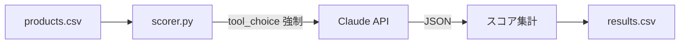

:::message
この記事は、Claude Codeを執筆支援に使った "毎朝1本書く" 取り組みの一環で書いています。

- 目的: 自分のAI活用キャッチアップ。仕組み自体も毎月アップデートしていきます
- 体制: 題材選定・実装・下書きをClaude Codeで補助、Liatrisが動作確認と編集を経て公開判断
- 方針: Zennのガイドラインに真摯に向き合い、運営から指摘や警告があれば即座に取り組みを停止します

仕組みの全貌は[こちらの設計記事](https://zenn.dev/liatris/articles/20260701-zenn-kickoff)にまとめています。
:::

製品候補を仕入れるとき、毎回おなじ4軸で考えている。「日本で売れるか」「競合が飽和していないか」「差別化できるか」「コストが見合うか」——この判断を毎回手作業でやっていた。評価軸が固定なら、Claude API の構造化出力でパイプライン化できる。

## 設計：なぜ4軸を1呼び出しにまとめるか

最初に軸ごとに API を分けて呼ぶ実装を試した。1製品あたり4回のコールになり、遅い上にコストが上がる。それ以上に問題だったのが「矛盾スコア」だった——市場適合性と競合密度を別々に評価させると、軸間の整合性が失われ「需要は高いが競合も少ない（なぜ？）」といった不自然な結果が出た。

1回の呼び出しで4軸をまとめて採点させることで、Claude が軸間のバランスを考慮しながら出力するようになった。

評価軸の設計：

| 軸 | スコア | 方向 |
|---|---|---|
| `score_market` | 1–5 | 高いほど需要あり |
| `score_competition` | 1–5 | 高いほど競合が多い（**不利方向**） |
| `score_novelty` | 1–5 | 高いほど差別化あり |
| `score_viability` | 1–5 | 高いほど利益余地あり |

競合密度だけが「高いほど不利」になる。合算スコアでは `(6 - score_competition)` と逆転させて加算する。

## アーキテクチャ



入力 CSV に `name / description / price_jpy / category` の4カラムを用意する。出力に `score_*` と `judgment（有力/要調査/見送り）`、`reasoning` が追記される。

## Step 1: tool スキーマの定義

Claude API の `tools` パラメータでスコアの型と値域を強制する。`description` の書き方で出力の質が変わるため、ここが設計コストのかかる部分だった。

```python:src/scorer.py
SCORING_TOOL = {
    "name": "score_product",
    "description": (
        "製品の市場性を4軸で評価し、採用判定を返す。"
        "各軸は 1〜5 の整数。高いスコアが良好（競合密度は例外: 高いほど競合が多く不利）。"
    ),
    "input_schema": {
        "type": "object",
        "properties": {
            "score_market": {
                "type": "integer",
                "minimum": 1,
                "maximum": 5,
                "description": "市場適合性: 日本市場での需要見込み。5=明確な需要あり, 1=需要不明確",
            },
            "score_competition": {
                "type": "integer",
                "minimum": 1,
                "maximum": 5,
                "description": "競合密度: Amazon.co.jp等での既存商品の飽和度。5=激戦区, 1=ほぼ競合なし",
            },
            "score_novelty": {
                "type": "integer",
                "minimum": 1,
                "maximum": 5,
                "description": "製品新規性: カテゴリ内での差別化要素。5=明確なUSPあり, 1=汎用品と差別化困難",
            },
            "score_viability": {
                "type": "integer",
                "minimum": 1,
                "maximum": 5,
                "description": "事業性: 想定価格から推測される利益余地。5=高マージン期待, 1=利益確保困難",
            },
            "reasoning": {
                "type": "string",
                "description": "採点根拠を1〜2文で。軸間の整合性も意識すること。",
            },
        },
        "required": ["score_market", "score_competition", "score_novelty", "score_viability", "reasoning"],
    },
}
```

`reasoning` フィールドを必須にしておくと、Claude がなぜそのスコアを付けたかを一言残す。あとで出力を見直すとき、このフィールドが判断の手がかりになる。

## Step 2: API 呼び出しとバッチ処理

`tool_choice={"type": "tool", "name": "score_product"}` で特定ツールの呼び出しを強制する。これにより、テキスト回答にフォールバックされず、必ず JSON が返ってくる。

```python:src/scorer.py
def score_product(client: anthropic.Anthropic, product: dict) -> dict:
    user_message = f"""以下の製品を評価してください:

製品名: {product.get('name', '')}
説明: {product.get('description', '')}
想定価格: {product.get('price_jpy', '')} 円
カテゴリ: {product.get('category', '')}"""

    response = client.messages.create(
        model="claude-haiku-4-5-20251001",
        max_tokens=512,
        system="あなたはEC仕入れのエキスパートです。製品情報をもとに、日本市場での販売可能性を4軸で評価してください。",
        tools=[SCORING_TOOL],
        tool_choice={"type": "tool", "name": "score_product"},
        messages=[{"role": "user", "content": user_message}],
    )

    for block in response.content:
        if block.type == "tool_use" and block.name == "score_product":
            return block.input

    raise ValueError("score_product ツール呼び出しが返ってきませんでした")
```

バッチ処理では `time.sleep(delay)` を各呼び出しの間に入れてレートリミットを回避する。デフォルト1秒で、`--delay` オプションで変更できる。

## Step 3: 判定ロジック

```python:src/scorer.py
def compute_judgment(scores: dict) -> str:
    total = (
        scores["score_market"]
        + (6 - scores["score_competition"])  # 競合密度は逆転
        + scores["score_novelty"]
        + scores["score_viability"]
    )
    if total >= 15:
        return "有力"
    elif total >= 10:
        return "要調査"
    else:
        return "見送り"
```

閾値（15 / 10）は、最初に目視で20製品ほどスコアを見た結果から設定した。「有力と判断したいが total が13」という製品がいくつかあり、境界を実際の感覚に合わせて調整した。完全に自動化する前にサンプルを手動で確認するフェーズを挟むと、閾値の肌感がつかみやすい。

## 実行例

```bash
pip install anthropic
export ANTHROPIC_API_KEY=sk-...
python src/scorer.py --input products_sample.csv --output results.csv
```

サンプル入力 (`products_sample.csv`):

```csv
name,description,price_jpy,category
マルチツールカード,財布に入るカード型11機能ツール。定規/栓抜き/ドライバー等を内蔵,1800,アウトドア・工具
シリコン折りたたみボウル,食洗機対応・収納時1.5cm・キャンプや離乳食に使えるシリコンボウル,980,キッチン用品
LEDネックライト,両手フリーのネックウェア型ライト。最大600ルーメン・防水IPX4,2400,アウトドア・工具
```

出力例 (一部):

```
[1/3] 評価中: マルチツールカード
[2/3] 評価中: シリコン折りたたみボウル
[3/3] 評価中: LEDネックライト

✅ 完了: results.csv に書き出しました
  有力: 1 件
  要調査: 2 件
  見送り: 0 件
```

## データアナリスト視点

スコアを CSV に蓄積していくと、軸ごとの分布を確認できる。「有力」と判定された製品の特徴量を集めれば、どの軸の組み合わせが最終的な売上と相関するかが見えてくる。売上データと突合すれば、スコアモデルの精度を測るフィードバックループが作れる。

この設計は、特徴量を定義してからデータを集める機械学習のラベリング工程と構造が近い——どの軸をどう定義するかで結果が変わる、という点も含めて。

最初は「Claude に任せればスコアが出る」と思っていたが、運用してみると軸の `description` を少し変えるだけでスコア分布が動く。プロンプトチューニングの問題が、特徴量エンジニアリングの問題と同じ形で現れた。
