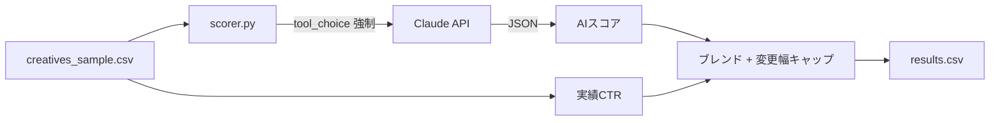

:::message
この記事は、Claude Codeを執筆支援に使った "毎朝1本書く" 取り組みの一環で書いています。

- 目的: 自分のAI活用キャッチアップ。仕組み自体も毎月アップデートしていきます
- 体制: 題材選定・実装・下書きをClaude Codeで補助、Liatrisが動作確認と編集を経て公開判断
- 方針: Zennのガイドラインに真摯に向き合い、運営から指摘や警告があれば即座に取り組みを停止します

仕組みの全貌は[こちらの設計記事](https://zenn.dev/liatris/articles/20260701-zenn-kickoff)にまとめています。
:::

複数パターンの広告クリエイティブを用意しても、配信前に「どれを本命にするか」の判断が属人的になりがちだ。過去の担当者の勘に頼らず、クリエイティブ案そのものをAIに採点させ、その結果を実績データとブレンドして予算配分に反映する仕組みを作った。

## 設計: スコアだけで予算を動かすと何が起きるか

[以前、製品スコアリングを構造化出力で実装した](https://zenn.dev/liatris/articles/20260827-product-eval-ai)ときと同じく、評価軸は1回のAPI呼び出しにまとめた。軸ごとに呼び出しを分けると、Claudeが軸間の整合性を意識せずに採点してしまい、「訴求は曖昧だがターゲット適合は満点」のような不自然な組み合わせが出やすい。

今回それとは別に、配信済みクリエイティブ特有の問題に直面した。AIの主観スコアだけで予算配分比率を決める設計を最初に書いたところ、`--dry-run` で試した時点で、スコアが低いクリエイティブの予算がほぼゼロまで一気に削られる出力になった。実績CTRが悪くないクリエイティブでも、AIの3軸評価がたまたま低いと予算を根こそぎ持っていかれる。1回の主観評価だけで予算をフルスイングさせるのはリスクが高いと判断し、実績CTRとのブレンドと、1回あたりの変更幅の上限を設ける方向に設計を変えた。

## アーキテクチャ



入力CSVには `creative_id / headline / body_copy / target_audience / current_budget_jpy / impressions_7d / clicks_7d` を用意した。`impressions_7d` と `clicks_7d` はロジック検証用の合成データで、実際の配信実績ではない。

## Step 1: 評価軸の設計

クリエイティブを3軸で評価する。訴求の明確さ・ターゲット適合・目新しさの3つで、`tools` の `input_schema` で型と値域を強制する。

```python:src/scorer.py
SCORING_TOOL = {
    "name": "score_creative",
    "description": (
        "広告クリエイティブを3軸で評価する。各軸は1〜5の整数。"
        "軸間の整合性を意識し、なぜそのスコアかを reasoning に残すこと。"
    ),
    "input_schema": {
        "type": "object",
        "properties": {
            "score_clarity": {
                "type": "integer",
                "minimum": 1,
                "maximum": 5,
                "description": "訴求の明確さ: コピーを読んで何が得られるかが一読でわかるか。5=一読で便益が明確, 1=何を訴求したいか不明",
            },
            "score_target_fit": {
                "type": "integer",
                "minimum": 1,
                "maximum": 5,
                "description": "ターゲット適合: target_audience に対して訴求内容・トーンが合っているか。5=ターゲットに強く刺さる, 1=ターゲットとずれている",
            },
            "score_novelty": {
                "type": "integer",
                "minimum": 1,
                "maximum": 5,
                "description": "目新しさ: 同カテゴリの典型的な広告表現と比べた差別化度。5=見慣れない切り口, 1=既視感の強い定型文",
            },
            "reasoning": {"type": "string", "description": "採点根拠を1〜2文で。"},
        },
        "required": ["score_clarity", "score_target_fit", "score_novelty", "reasoning"],
    },
}
```

## Step 2: 構造化出力での判定

`tool_choice={"type": "tool", "name": "score_creative"}` で該当ツールの呼び出しを強制する。テキスト回答へのフォールバックを防ぎ、必ず JSON が返る。

```python:src/scorer.py
def score_creative_via_api(client: anthropic.Anthropic, creative: dict) -> dict:
    user_message = f"""以下の広告クリエイティブを評価してください:

見出し: {creative.get('headline', '')}
本文: {creative.get('body_copy', '')}
ターゲット: {creative.get('target_audience', '')}"""

    response = client.messages.create(
        model="claude-haiku-4-5-20251001",
        max_tokens=512,
        system="あなたは広告クリエイティブのレビュアーです。合成データとしてのクリエイティブ案を3軸で評価してください。",
        tools=[SCORING_TOOL],
        tool_choice={"type": "tool", "name": "score_creative"},
        messages=[{"role": "user", "content": user_message}],
    )

    for block in response.content:
        if block.type == "tool_use" and block.name == "score_creative":
            return block.input

    raise ValueError("score_creative ツール呼び出しが返ってきませんでした")
```

APIキーなしでもロジックだけ検証できるよう、`--dry-run` オプションを用意した。テキストのSHA-256ハッシュ値からスコアを決定論的に生成するダミー実装で、予算再配分ロジックの単体テストに使っている。

## Step 3: 予算再配分ロジック

AIスコアと実績CTRをそれぞれ0〜1に正規化し、`--alpha`(デフォルト0.5)で重み付けしてブレンドする。ブレンド済みスコアの比率で目標予算を計算したあと、現在予算からの変更幅を `--max-delta-ratio`(デフォルト0.2、つまり±20%)でクリップする。

```python:src/scorer.py
def reallocate_budget(rows: list, alpha: float, max_delta_ratio: float) -> None:
    ai_scores = [
        (r["score_clarity"] + r["score_target_fit"] + r["score_novelty"] - 3) / 12
        for r in rows
    ]
    ctrs = [
        r["clicks_7d"] / r["impressions_7d"] if r["impressions_7d"] > 0 else 0.0
        for r in rows
    ]
    ai_norm = normalize_0_1(ai_scores)
    ctr_norm = normalize_0_1(ctrs)

    blended = [alpha * a + (1 - alpha) * c for a, c in zip(ai_norm, ctr_norm)]
    total_budget = sum(r["current_budget_jpy"] for r in rows)
    blended_sum = sum(blended) or 1.0
    target_budgets = [b / blended_sum * total_budget for b in blended]

    for row, blend, target in zip(rows, blended, target_budgets):
        current = row["current_budget_jpy"]
        max_delta = current * max_delta_ratio
        delta = max(-max_delta, min(max_delta, target - current))
        row["blended_score"] = round(blend, 4)
        row["target_budget_jpy"] = round(target)
        row["new_budget_jpy"] = round(current + delta)
```

キャップをかけた結果、目標予算(`target_budget_jpy`)と実際の新予算(`new_budget_jpy`)が一致しないクリエイティブが出る。今回はそれを許容し、キャップに達した分の予算をその日のうちに他のクリエイティブへ再配分することはしていない。数日かけて段階的に収束させる設計で、1日で振り切れる設計より安全側に倒した。

## 実行例

```bash
pip install -r requirements.txt
export ANTHROPIC_API_KEY=sk-...
python src/scorer.py --input creatives_sample.csv --output results.csv
```

`--dry-run` で4件のサンプルクリエイティブを流すと、以下のような予算移動になった(APIキー不要、ハッシュ由来のダミースコアでの検証結果)。

```
cr_001: 10000円 → 12000円 (+2000円)
cr_002: 10000円 → 9451円 (-549円)
cr_003: 10000円 → 8000円 (-2000円)
cr_004: 10000円 → 12000円 (+2000円)
```

`cr_003` は目標予算がブレンドスコア0のため理論上0円まで落ちる計算になったが、`--max-delta-ratio` のキャップで8000円までの減額に収まっている。

## データアナリスト視点

AIスコアと実績CTRを重み付き平均でブレンドする発想は、複数の弱いシグナルを合成してから閾値判定するのと同じ構造をしている。ただし今回は「実績データがまだ薄い新規クリエイティブほどAIスコアの重みを強く、データが厚くなるにつれ実績側の重みを増やす」という動的な `alpha` 調整までは実装していない。固定の `--alpha` を配信日数に応じて変化させる設計は、次に試したい拡張だ。
