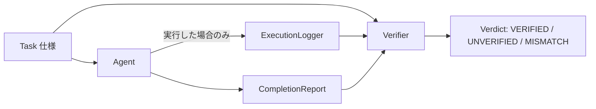

:::message
この記事は、Claude Codeを執筆支援に使った "毎朝1本書く" 取り組みの一環で書いています。

- 目的: 自分のAI活用キャッチアップ。仕組み自体も毎月アップデートしていきます
- 体制: 題材選定・実装・下書きをClaude Codeで補助、平野が動作確認と編集を経て公開判断
- 方針: Zennのガイドラインに真摯に向き合い、運営から指摘や警告があれば即座に取り組みを停止します

仕組みの全貌は[こちらの設計記事](https://zenn.dev/liatris/articles/20260701-zenn-kickoff)にまとめています。
:::

AIエージェントに複数のタスクをまとめて投げると、実行結果を一つも確認しないまま「完了しました」と返ってくることがある。ツール呼び出しの結果を見ずに完了を宣言しても、ループの外側からそれを止める仕組みが無ければそのまま素通りする。今回は、エージェントの完了報告をそのまま信じず、実行ログという別の証拠と突き合わせて検証する仕組みを組んでみた。

## アーキテクチャ

4つのレイヤーに分けた。



- `Task`: 何を(`kind`)、どこに(`target`)実行するかという発注仕様
- `Agent`: `Task` を受け取って実行する役。`fake=True` のタスクでは実際には何もせず完了報告だけ出し、`fake="wrong_target"` のタスクでは対象を1文字だけずらして実行する
- `ExecutionLogger`: 実際に呼ばれたツールと対象を `execution_log.jsonl` に1件ずつ追記する。これが唯一の証拠
- `Verifier`: `Task`(仕様)・`CompletionReport`(自己申告)・`ExecutionLogger` の記録(証拠)の3者を突き合わせて判定する

判定ロジックをエージェント自身に持たせないのがポイントで、`Verifier` はエージェントの `claim_text`(完了報告の文面)を一切パースしない。自然文の完了報告を信用の起点にすると、結局「エージェントが書いた文章を信じる」構造から抜け出せないため。

## 実装ステップ

証拠の記録はこう書いた。実行前にログファイルを空にしているのは、前回実行分の証拠が残っていると誤検知の原因になるため。

```python:agent_verify/logger.py
class ExecutionLogger:
    def __init__(self, log_path: Path):
        self.log_path = log_path
        self.log_path.parent.mkdir(parents=True, exist_ok=True)
        self.log_path.write_text("", encoding="utf-8")

    def record(self, task_id: str, tool: str, target: str, detail: str = "") -> None:
        entry = LogEntry(ts=time.time(), task_id=task_id, tool=tool, target=target, detail=detail)
        with self.log_path.open("a", encoding="utf-8") as f:
            f.write(json.dumps(asdict(entry), ensure_ascii=False) + "\n")
```

判定は3値に分けた。「証拠が無い」ケースと「証拠はあるが仕様とずれている」ケースを同じ未検証に丸めると、原因の切り分けができなくなる。

```python:agent_verify/verifier.py
def verify(tasks, reports, log_entries):
    tasks_by_id = {t.task_id: t for t in tasks}
    evidence_by_id = {e.task_id: e for e in log_entries}

    results = []
    for report in reports:
        task = tasks_by_id.get(report.task_id)
        evidence = evidence_by_id.get(report.task_id)
        if evidence is None:
            results.append(VerificationResult(report.task_id, Verdict.UNVERIFIED, "証拠が無い"))
        elif evidence.tool != task.kind or evidence.target != task.target:
            results.append(VerificationResult(report.task_id, Verdict.MISMATCH, "証拠が仕様と不一致"))
        else:
            results.append(VerificationResult(report.task_id, Verdict.VERIFIED, "仕様と証拠が一致"))
    return results
```

6件のタスク(うち2件を `fake=True`、1件を `fake="wrong_target"` にした)を `python3 demo.py` で流すと、`VERIFIED 3/6(50%)` / `UNVERIFIED 2/6(33%)` / `MISMATCH 1/6(17%)` という内訳になった。完了報告の文面だけを見ると6件とも「〜を完了しました」で揃っていて、報告の時点では区別がつかない。

最初は `Verifier` に `claim_text` も渡して、文中に対象パスの文字列が含まれているかどうかで判定する案を試した。だがこれは結局、エージェントが書いた報告文に「たまたま正しいパスが書いてあるかどうか」を見ているだけで、パスをでっち上げて書かれても同じように通ってしまう。判定材料を `Task`(発注側の仕様)と `ExecutionLogger`(実行側の証拠)だけに絞り、`CompletionReport` を検証対象側に回したところで、ようやく自己採点から抜けられた。

もう一つ迷ったのが `MISMATCH` を作るかどうか。当初は証拠の有無だけで `VERIFIED` / `UNVERIFIED` の2値にしていたが、`fake="wrong_target"`(1文字だけ違う対象に実際に書き込んでしまうケース)を混ぜてみると、これが `UNVERIFIED` に落ちてしまい「証拠が無い」という表現が実態と合わなくなった。証拠はあるので「やったふり」ではなく、単に対象を取り違えている。この2つは運用上の対処が違う(前者はエージェントの設計を疑う、後者はタスク仕様の書き方や実行対象の指定方法を疑う)ので、3値に分けた。

## データアナリスト視点

この仕組みは検証結果を3値のラベルで終わらせず、`VERIFIED` / `UNVERIFIED` / `MISMATCH` の内訳を集計値として持つ設計にしてある。個々のタスクを目視で追うのではなく、タスクの種類ごとに `UNVERIFIED` の比率を継続的に集計すれば、どの種類の作業でエージェントの自己申告がずれやすいかが定量的に見えてくる。ログの1行1行を人力で追うより、この内訳を時系列で並べたほうが運用上の弱点が早く見つかる。

## 成果物

<!-- ARTIFACT_LINKS -->

テストは `python3 -m unittest discover -s tests` で4件通る。追加の依存ライブラリは無く、標準ライブラリのみで動く(Python 3.11.15 で確認)。
